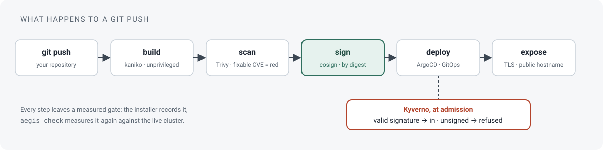
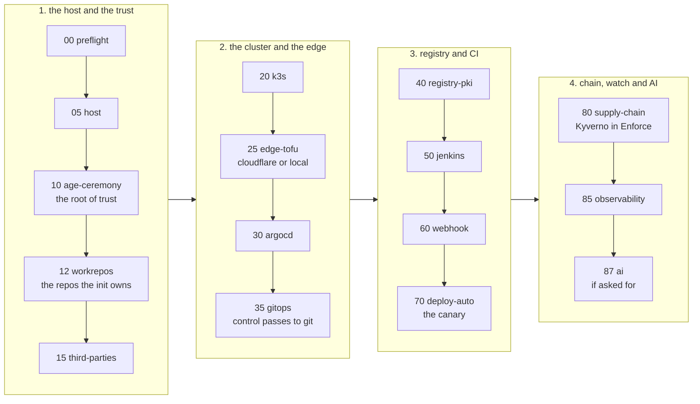
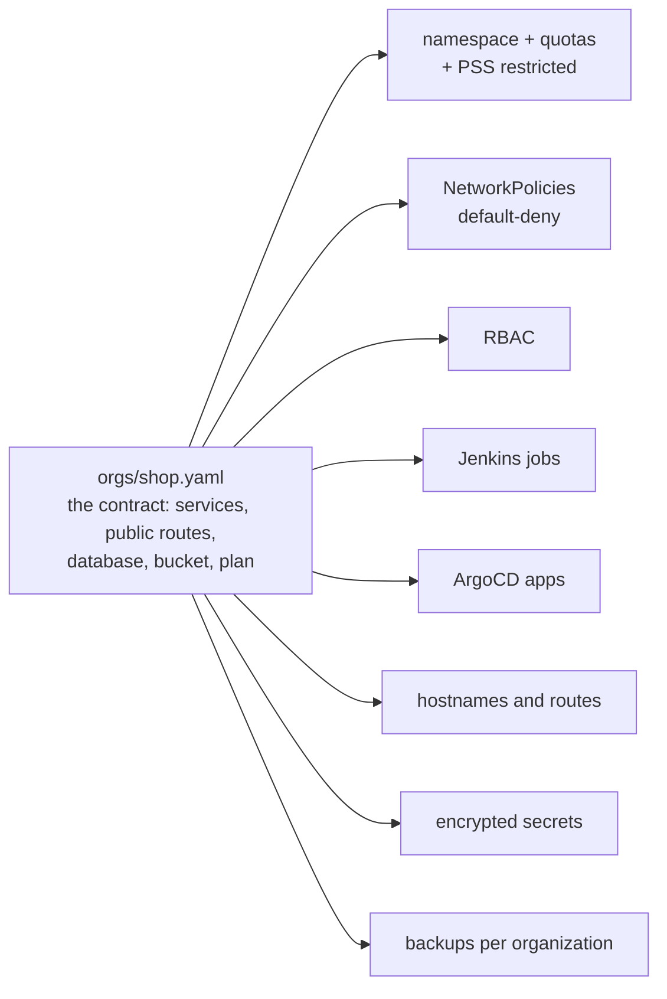
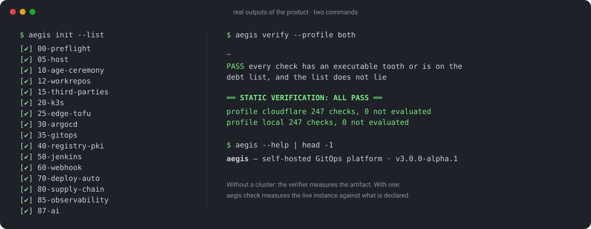
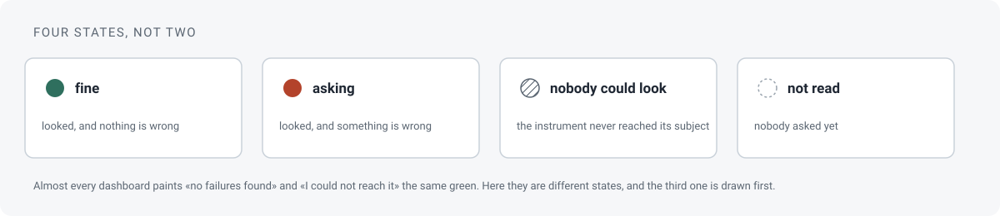

# aegis

**You `git push`. Your server builds, scans, signs and publishes.**

[](https://github.com/MEMEMEMEMEMEMEDev/aegis-infra/actions/workflows/verify.yml)
· Léelo en español: [README.md](README.md)



aegis turns a Linux machine and a GitHub account into a deployment
platform of your own. One command, `aegis init`, installs Kubernetes
(k3s), ArgoCD, Jenkins, an image registry, the vulnerability scanner,
image signing and observability, and wires them together. From then
on, every push to an application repository is built in an
unprivileged pod, scanned, signed by digest, deployed by GitOps and
exposed to the internet with TLS. An unsigned image does not enter the
cluster.

For whoever pushes, the experience resembles Vercel, with one
difference: the server, the data and the keys are yours. For whoever
operates it, today it is a platform engineering tool: the console for
the product team does not exist yet.

**Status: technical preview (`v3.0.0-alpha.1`).** This is a version for
developers and platform people. The whole install has already run end
to end on a machine that was not the author's (see [Where it has been
run](#where-it-has-been-run)), and every claim on this page comes from
a check that can be run again. It needs polish. There is a visual
console for the operator; the tenant's console does not exist yet.

---

## What you get

- **A platform from one command.** `aegis init` runs sixteen phases.
  Running it again does not repeat what already passed.
- **A complete supply chain.** Unprivileged builds (kaniko), scanning
  (Trivy), signing by digest (cosign) and mandatory admission
  (Kyverno). The platform's own images follow the same rule.
- **Applications from a contract.** One YAML per organization. From it
  come the namespace, quotas, network policies, RBAC, jobs, ArgoCD
  apps, hostnames, secrets and backups.
- **Observability with alerts on your phone.** VictoriaMetrics,
  Grafana, probes and an events log, with notices through ntfy. There
  is a heartbeat: if the platform stops reporting, that is a notice
  too.
- **Recovery, rehearsed.** Backup and restore of the state and of the
  data, rotation of every credential the init generates, and `aegis
  destroy` to undo it all.
- **A verifier.** 239 static checks measure this repository without a
  cluster (`aegis verify --list` counts them). Each one carries its
  *tooth*: a mutation that proves the check fails when it should.
  `aegis check` does the same against the live cluster.

## Before you start

| | |
|---|---|
| **Host** | **Ubuntu 24.04 or newer**, with `sudo`. Other distributions (Arch, CachyOS, Fedora, Debian, Mint, Pop!_OS) are refused before anything is touched: aegis uses `apt` and Ubuntu's defaults. |
| **Resources** | 4 CPU and 8 GB of RAM are enough (it warns below 7 GB). 25 GB free on `/`. `aegis host measure` measures your machine; `aegis host budget` says whether what the platform reserves fits in what the machine leaves. |
| **If you share the machine** | With a graphical session, aegis reserves a floor of memory for the desktop and does not touch it. `aegis host floor --set` changes it. |
| **GPU (optional)** | For the AI's GPU lane: an NVIDIA card with driver 570 or newer. It is shared with your desktop; `aegis host show` says how much VRAM there is. |
| **Network** | Outbound internet over IPv4, a clock on time, IPv6 off. The preflight probes and fixes what it can. |
| **GitHub** | An account with `gh auth login` done and a git identity configured. The init creates two repositories (platform and canary) and later one per application. A dedicated account or organization is the most comfortable. |
| **Cloudflare (optional)** | A zone in your account, for the `cloudflare` profile: public hostnames, a tunnel and TLS from Let's Encrypt. Without it, the `local` profile brings up the same platform on names that resolve to the host, with TLS from the instance's own CA. |

What to have at hand:

- **A safe place for the age key.** It is the root of trust: it
  decrypts everything, and losing it is losing everything encrypted,
  backups included. Phase 10 generates it, shows it once and demands a
  backup it really validates. Decide beforehand where it goes (password
  manager, USB stick, paper) and not on the same host. Do not record
  the session during that phase.
- **With Cloudflare:** the account ID, the zone ID and one master
  credential (the Global API Key, or a token with "Account API Tokens:
  Edit"). The init mints its two scoped tokens with it and does not
  keep it.
- **Unattended** (`--non-interactive`): `AEGIS_AGE_BACKUP_FILE` and,
  with Cloudflare, `CF_MASTER_FILE`.

You do not need to prepare cosign keys, certificates, DNS records, the
tunnel or the internal registry's credentials. The init generates all
of it.

## Install

```bash
git clone https://github.com/MEMEMEMEMEMEMEDev/aegis-infra && cd aegis-infra
./bin/aegis preflight      # leaves the machine ready, or says what is missing
gh auth login              # your GitHub account: the init creates the repos for you
tmux new -s aegis          # the run is long; a dropped ssh must not kill it
./bin/aegis init           # the wizard asks what it cannot infer, then sixteen phases
```

It takes hours, not minutes. The long phase is 80, which mirrors and
builds the platform's images. From here on this page writes `aegis`
alone: it is `./bin/aegis` from the checkout, and `aegis --help` is the
map.

**What the wizard asks.** The edge profile (`cloudflare` or `local`),
the names of the two repositories, the root domain and, with
`cloudflare`, the two IDs. The rest it infers: the GitHub owner from
the `gh` session, the email from `git config`. It shows a summary, asks
for confirmation and writes `~/aegis/aegis.conf`.

**Where everything lives.** This checkout is the product and is not
written during a run. The instance lives in `~/aegis`: the
configuration in `aegis.conf`, the platform repository in `platform/`,
the phase markers and the gates in `.init-state/`, the encrypted store
in `.state-secrets/`.

**When it finishes.** The consoles hang off the root domain:
`argocd.`, `jenkins.`, `grafana.` and `ntfy.<domain>`. At
`aegis.<domain>` lives the canary, the first application the platform
built, signed and deployed. With `cloudflare` the consoles sit behind
Cloudflare Access; with `local`, the browser will warn until you import
the CA. The admin passwords are born encrypted in
`~/aegis/.state-secrets/` and are read with the age key:

```bash
export SOPS_AGE_KEY_FILE=~/.config/sops/age/aegis.key
sops -d --input-type binary --output-type binary ~/aegis/.state-secrets/jenkins_admin_pass.enc
```

The routine, afterwards:

```bash
aegis check               # measures the live cluster against what is declared; writes nothing
aegis init --list         # which phases there are and which passed
```

<details>
<summary><b>If it stops</b></summary>

When a phase fails, the init stops there and leaves its gate recorded.
Fix the cause and resume:

```bash
aegis init --from 30      # resumes from phase 30
aegis init --only 60      # repeats a single phase
aegis init --check        # measures without changing anything
aegis init-log            # the same as init, leaving a full dossier of the run
```

`aegis init-log` prints the dossier's path before it starts. The black
box is `.init-state/gates.jsonl`; `docs/OPERATE.md` says where to start
diagnosing. If you are going to ask for help, send the `fail` line of
that file and the dossier.

To start over on the same host:

```bash
aegis destroy             # without --yes it only says what it would remove
aegis destroy --yes --k3s # removes the edge, the bridge and the cluster
aegis init --reset-state  # forgets every gate and starts again
```

`aegis destroy` does not delete the GitHub repositories: they carry a
topic that marks them as the init's own, and a new run reuses them.

</details>

With your own domain on Cloudflare and your GPU, the full journey is in
[docs/journeys/your-machine.md](docs/journeys/your-machine.md): what to
prepare, what to expect from each phase and what to send when something
stops.

## Your first application

Everything happens in the instance's platform repository. The
contracts live there, in `orgs/`, and the commit is made there.

```bash
cd ~/aegis/platform
aegis app new shop --template base   # writes contract, skeleton, derivations and secrets; touches nothing outside
git diff                             # read what it generated
git add -A && git commit -m "org: shop" && git push
aegis sync root                      # ArgoCD picks up the new organization
aegis app apply shop                 # creates the repo, the deploy key and the webhook on GitHub
```

From the first push to the application's repository, the platform
builds, scans, signs, deploys and exposes it. The template is used
once: from there the contract and the repository are yours. To change
something, edit the contract and derive again:

```bash
$EDITOR orgs/shop.yaml               # add postgres, a bucket, another service
aegis org plan orgs/shop.yaml        # what would change, without writing
aegis org apply orgs/shop.yaml       # writes the manifests
aegis secret create orgs/shop.yaml   # if new secrets appeared
```

`seed/platform/docs/platform-for-developers.md` is the page for the
team that will push: what happens to every push and which rules refuse
it.

## How it works

### Sixteen phases, four stages



Every phase leaves a marker and records its gates in
`.init-state/gates.jsonl`. The order matters: the admission policy is
switched on once there is a signed image to admit, and observability
comes last because it measures what already exists.

<details>
<summary><b>The sixteen phases, one by one</b></summary>

| phase | what it does |
|---|---|
| `00-preflight` | Checks the preconditions. Launches the wizard if there is no `aegis.conf`. If something is missing, it aborts here and not halfway through the cluster. With `AI=gpu` it measures the driver before going on. |
| `05-host` | Installs the pinned tools on the host (tofu, sops, age, kubectl, helm, cosign, direnv, jq, git), verifying the checksum each author publishes. Installs the user clocks: backup, host metrics, update notice. |
| `10-age-ceremony` | Generates the age key, validates it with a real encrypt and decrypt, demands a backup and writes `.sops.yaml`. The only phase that shows a secret. |
| `12-workrepos` | Creates and seeds the init's two repositories on GitHub (platform and canary), marked with a topic. If they exist, it reuses them. |
| `15-third-parties` | Third-party credentials without a browser: deploy keys, webhook HMAC, CI credential. With `cloudflare`, the scoped tokens. |
| `20-k3s` | Prepares the kernel and installs pinned k3s, with Ansible. |
| `25-edge-tofu` | Brings up the edge. With `cloudflare`: tunnel, DNS and Access with OpenTofu. With `local`: a systemd bridge that hands ports 80 and 443 to Traefik. |
| `30-argocd` | Installs ArgoCD with helm (the only imperative install) and creates the bootstrap Secrets, the age key for KSOPS among them. |
| `35-gitops` | Hands control to GitOps: AppProjects, root App and syncs in order. |
| `40-registry-pki` | Internal image registry with its own PKI and TLS from day one. |
| `50-jenkins` | Jenkins with jobs defined in code from the first boot. Ends with the CI tooling image built and published. |
| `60-webhook` | Checks end to end that a push reaches Jenkins, one gate per link. |
| `70-deploy-auto` | Automatic deploy of the canary: the pipeline writes the digest and ArgoCD deploys. First it proves that a commit touching only manifests fires no build. |
| `80-supply-chain` | Trivy server, cosign key and the Kyverno policy in Enforce, switched on at the end, once the first signed image exists. Builds the in-house base images. |
| `85-observability` | VictoriaMetrics, vmalert, Grafana, probes and events log, with a heartbeat that reaches ntfy. |
| `87-ai` | The AI subsystem, if asked for. `AI=no` skips it and writes that down; `AI=cpu` brings up gateway, controller and a small engine; `AI=gpu` measures driver and runtime before touching anything. The engines are born off. |

</details>

### Product and instance

```mermaid
flowchart LR
    subgraph P["the product: this repository, read-only during a run"]
        direction TB
        p1["bin/ libexec/ lib/<br/>the commands"]
        p2["init/<br/>the sixteen phases"]
        p3["verify/<br/>239 checks and their teeth"]
        p4["seed/<br/>what ships"]
    end
    subgraph I["the instance: ~/aegis, living state"]
        direction TB
        i1["aegis.conf"]
        i2["platform/<br/>the GitOps repo, on GitHub"]
        i3[".init-state/<br/>markers and gates"]
        i4[".state-secrets/<br/>the store, encrypted with age"]
    end
    P -- "aegis init<br/>seeds, installs, measures" --> I
    P -- "aegis seed apply<br/>brings a fix from the seed" --> I
    I -- "aegis check, aegis state backup<br/>aegis data backup, aegis rotate" --> I
```



One file decides where everything lives, with a copy in bash and one in
python, so that two commands cannot disagree. What is not in `seed/`
does not ship. When the product changes, `git pull` brings the fix to
the machine and `aegis seed apply` brings it to the instance, keeping
what is the instance's own.

### One contract, everything else derived



`aegis org apply` regenerates everything from the contract, in marked
blocks rewritten whole. `aegis org plan` shows what would change before
touching anything.

### The supply chain, in six steps

1. A push reaches Jenkins by webhook (or by polling, with `local`).
2. kaniko builds the image in an unprivileged pod.
3. Trivy scans. A fixable HIGH or CRITICAL vulnerability stops the
   build.
4. cosign signs by digest, never by tag, with the instance's key.
5. The pipeline writes the digest into the kustomize overlay and
   commits. ArgoCD deploys.
6. Kyverno, in Enforce, refuses at admission any image without a valid
   signature.

The platform's own images follow the same discipline: one job mirrors
only pinned versions from outside, another builds the in-house bases
and proves them by starting them before signing, and `image-watch`
re-scans everything daily.

### Six rules

- The contract is the only source of truth. Everything else is derived.
- A command run again with the work already done ends in "nothing to
  do".
- Four outcomes, always: `0` done or already so, `1` wrong or missing,
  `2` could not evaluate, `3` invalid usage. An instrument that never
  reached its subject does not say the subject is fine.
- A gate with no subject is recorded as such. A build that never
  appeared is a failure.
- Every check ships with the mutation that proves it bites
  (`aegis verify --teeth`).
- The product names no machine and no person. Two checks watch that.



## The console

```bash
aegis console serve            # http://127.0.0.1:7391
```


A visual layer on top of the CLI. Every screen is drawn from the
documents the commands already emit; it measures nothing of its own
and can run nothing you cannot. It has no AI agent: a platform whose
job is to say what is true about your machine does not guess.



It is organized the way the consoles you already know are: Projects,
Deployments, Domains, Traffic, Storage, Security, Machine and Health,
and beside each entry the worst state of what feeds it. It opens with
your projects and with the repositories nobody runs yet. It signs a
project up in three cards and writes the contract, the manifests and
the missing secrets. It does not commit, push, apply or touch the
cluster: ArgoCD reads the remote, so nothing runs until you commit.


It carries a guided tour of fifteen steps. It is not published through
the tunnel: you reach it with `ssh -L 7391:127.0.0.1:7391`. The reasons,
the security model and what is still missing are in
[docs/console.md](docs/console.md).

## The commands

`aegis --help` prints the menu and `aegis <cmd> --help` the detail of
each one. All return the same four exit codes, except `aegis verify`,
which uses 0, 1 and 3.

| group | commands |
|---|---|
| setup | `aegis preflight`, `aegis init`, `aegis init-log`, `aegis verify`, `aegis destroy` |
| apps | `aegis app`, `aegis org`, `aegis quota`, `aegis repos`, `aegis image`, `aegis secret` |
| operate | `aegis check`, `aegis console`, `aegis update`, `aegis tenant`, `aegis traffic`, `aegis capacity`, `aegis builds`, `aegis host`, `aegis sync`, `aegis seed`, `aegis ai` |
| infra | `aegis ci`, `aegis edge`, `aegis registry`, `aegis rotate`, `aegis webhook` |
| backup | `aegis data`, `aegis state` |

<details>
<summary><b>Every command, in one line</b></summary>

**setup**

| command | what it does |
|---|---|
| `aegis preflight` | Leaves the machine in the state the init needs. Without arguments it acts and repairs. |
| `aegis init` | Brings up the platform phase by phase and records one gate per step. `--from N`, `--only N`, `--check`, `--list`, `--reset-state`, `--non-interactive`. |
| `aegis init-log` | `aegis init` under `script`, leaving a full dossier of the run. |
| `aegis verify` | The static checks, without a cluster. `--profile cloudflare\|local\|both`, `--only NNN`, `--teeth [NNN]`, `--with-charts`, `--list`. |
| `aegis destroy` | Undoes the init's footprint; `--k3s` the cluster too; `--purge-secrets`, the store. Without `--yes` it only says what it would do. |

**apps**

| command | what it does |
|---|---|
| `aegis app` | `new` writes the whole sign-up to files without touching anything outside; `apply` does the GitHub steps: repo, deploy key, webhook (`--check` to see it first). |
| `aegis org` | `plan` shows what would change; `apply` writes the manifests; `validate`, `list`, `schema`, `edge`, `routes`, `delete`, `migrate`. |
| `aegis quota` | The plans a project may take. `list`, `add`, `set`, `remove`. Never a number in a contract. |
| `aegis repos` | The account's repositories, with their language and which organization deploys them. |
| `aegis image` | The base images the platform builds and signs. `request`, `list`, `from`, `check`, `gc`. |
| `aegis secret` | `create` the missing encrypted secrets; `rotate` the material; `move` to another namespace. |

**operate**

| command | what it does |
|---|---|
| `aegis check` | The round: measures the live cluster against what is declared. Writes nothing. |
| `aegis console` | `serve` the console on loopback; `capture` saves a state of the world as a case; `draw` draws a case's screens without a server. |
| `aegis update` | `inventory` what runs and what exists upstream; `plan` what a window would raise; `window` the whole protocol, dry unless `--yes`; `rollback`, `status`, `metrics`. See [the protocol](seed/platform/docs/protocols/updates.md). |
| `aegis tenant` | One organization as the cluster has it, against what its contract declares. |
| `aegis traffic` | What reached each organization, read from Traefik's metrics, reconciled against the total. |
| `aegis capacity` | Does another organization fit? The node against what the plans cost. |
| `aegis builds` | What happened to each push: built, scanned, signed, digest written down. |
| `aegis host` | `measure` the machine; `show`; `floor` the desktop's memory floor; `budget` whether the platform fits; `metrics`. |
| `aegis sync` | An ArgoCD sync of the named apps; `--drifted` everything not Synced. |
| `aegis seed` | `diff` what the seed changed and this instance lacks; `apply` brings it over keeping pins and derived blocks, in a commit you read and push. |
| `aegis ai` | The operator's control over the AI subsystem. |

**infra**

| command | what it does |
|---|---|
| `aegis ci` | `build` fires the platform's image jobs in order; `jobs`; `digests`; `quiet on\|off` so that a push does not build on a platform half changed. |
| `aegis edge` | `check` compares the live hostnames with the ones derived from the contracts. |
| `aegis registry` | `check` the internal registry credential in its ten destinations; `rotate` generates it anew. |
| `aegis rotate` | The rotation protocol: `list`, `check`, `run`, `continue`. |
| `aegis webhook` | `check` that every repository with a job has a webhook; `apply` creates the missing ones. |

**backup**

| command | what it does |
|---|---|
| `aegis data` | The tenants' data, one bundle per organization: `backup`, `list`, `restore`, `size`, `remote` (the off-site destination: `bucket`, `adopt`, `push`, `status`, `cadence`). |
| `aegis state` | `backup` and `restore` of the three states that live only on this machine: the encrypted store, the phase markers and the edge's tfstate. |

`state` is the machine; `data` is the tenants. The backup of one does
not restore the other.

</details>

## Where it has been run

| where | what | result |
|---|---|---|
| A rented VPS (4 CPU, 16 GB, Ubuntu, nothing on it but ssh), a fresh GitHub account, no domain (`local` profile) | `aegis init` from zero, 2026-08-27 | 15 of 15 phases, 174 gates passed, 20 recorded as not evaluable (they need a public edge) |
| same host | two applications signed up from their contracts, their data restored from backups | 12 products and 4 orders served over HTTPS |
| same host | supply chain end to end | signed image admitted; unsigned image refused citing the policy |
| same host | `aegis state backup` and `aegis state restore` into a second instance directory | round trip verified |
| same host, dirty | `aegis destroy --k3s` and a second `aegis init` over the leftovers | 15 of 15 phases; what a previous instance leaves behind is detected and repaired by the init |
| the author's machine | the instance this version comes from, with the `cloudflare` profile | in daily use |

The figures are left as they came out: they say 15 phases because there
were fifteen then; phase 87 came later. The full table, gate by gate, is
in `docs/journeys/foreign-instance.md`.

That first run on a foreign machine needed fourteen resumes and brought
out about thirty defects the static checks could not see. They are all
closed, each with a check, and their classes are named in
`seed/platform/docs/failure-modes.md`.

## What is not there yet

Said plainly, because the checks would say it anyway.

- The `cloudflare` profile has not been run on a foreign machine.
- Restoring across instances is not automatic: the bundle comes
  encrypted with the age key of the instance that made it, and
  `restore` demands `--force` when it detects the database credential
  changed.
- One repository per service. The monorepo is not first class.
- Kyverno only reaches registries signed by the instance's CA; a public
  image is refused with an `x509` error, not with "unsigned".
- Single node. No HA, no multi-cluster: a platform for a team and its
  projects, not for a fleet. A 4-CPU node admits one build at a time.
  In memory, the whole platform reserves around 14 GB and can ask for
  twice that at its ceilings, measured on one machine on 2026-09-09;
  `aegis host budget` measures it on yours.
- Some identifiers inside the seed are still in Spanish, on purpose.
  The glossary lists the pending ones.
- The VRAM watcher only warns. When the desktop and the engines run out
  of card, aegis says so and shuts nothing down.
- The memory budget is a floor, not a ceiling: it reads the seed's
  manifests, not each chart's defaults.
- The console is the operator's. It runs on loopback and is reached
  over an SSH tunnel. The tenant's needs Cloudflare Access with more
  than one email, and today it admits one.
- The console adds and changes, and never removes. Deleting a service
  is `aegis org` by hand.
- Outside the console, it still expects you to read.

Next, in this order and without dates: the `cloudflare` profile on a
foreign machine; the tenant's console; the monorepo as a first-class
case.

## What is inside

```
bin/          the dispatcher (aegis <command>)
libexec/      one file per command
lib/          the shared helpers, bash and python
init/         the orchestrator and its sixteen phases
verify/       the checks, their teeth, the harnesses
seed/         what ships: the platform repo, the canary, the templates
share/        the exit codes and the systemd units
docs/         AGENTS.md, OPERATE.md, console.md, the glossary, the journeys
```

In the cluster: k3s without the stock Traefik and servicelb, installed
by Ansible; ArgoCD with KSOPS; Jenkins with jobs in code and kaniko;
Trivy, cosign and Kyverno; Traefik and cert-manager with an internal
CA; cloudflared only with `cloudflare`; an internal image registry with
its own TLS; Garage (S3) and Postgres as service types, with one bucket
and one database per organization; VictoriaMetrics, VictoriaLogs,
Grafana, Vector, blackbox-exporter, Alertmanager and ntfy;
NetworkPolicies per tenant and PSS restricted in every namespace. The
versions are pinned in one place and `aegis update inventory` says
which ones run.

Where to read next:

- [docs/journeys/your-machine.md](docs/journeys/your-machine.md), if you
  are going to install it with your domain and your GPU.
- [docs/OPERATE.md](docs/OPERATE.md), if you are going to run an
  instance: expected state, diagnosis, recovery tools.
- [docs/console.md](docs/console.md), if you are going to use the
  console.
- [docs/AGENTS.md](docs/AGENTS.md), if you are going to change the
  product: the method and the rules born from real incidents.
- `docs/glossary.md` is the vocabulary, and `aegis verify` enforces it.
- `seed/platform/docs/failure-modes.md` catalogues the failure classes
  with their signature and their fix.
- `seed/platform/docs/platform-for-developers.md` is what the team that
  pushes reads.

## About the language and the history

The product is in English: code, identifiers, messages, the seed and
the internal documentation. The Spanish `README.md` is the front page
for now; this file is the English version. The commit history is in
Spanish on purpose: it is a work log, and it tells how each bug was
found.

This history starts with the v3 rebuild. The earlier work (version 2,
which still runs the author's instance) lives in private repositories,
because it carries the identity of one concrete instance. This project
did not come out of one session or one prompt: every piece above has
failed runs behind it, and checks born from them.

## Contributing, security, licence

- `CONTRIBUTING.md`: one item, one commit; a check for every fix; a
  tooth for every check; `aegis verify --profile both` green before
  committing. Nothing is done until a run validates it on a real
  instance.
- `SECURITY.md`: how to report a vulnerability privately, through this
  repository's private GitHub report, never through a public issue.
- Apache License, version 2.0; see `LICENSE`.
