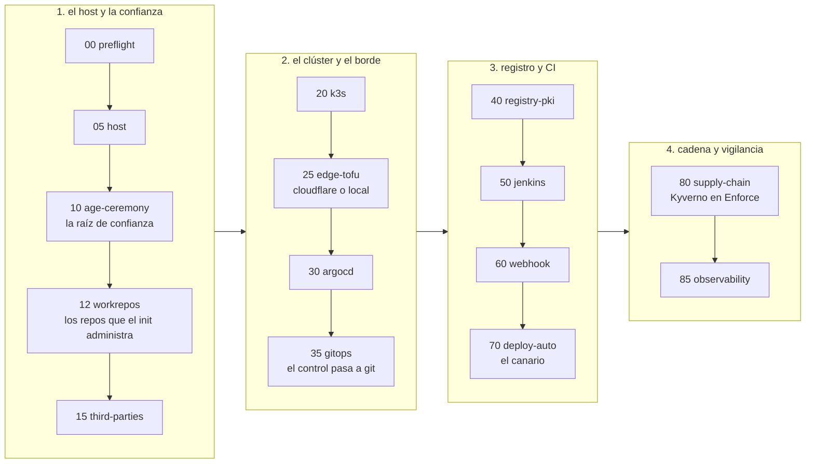
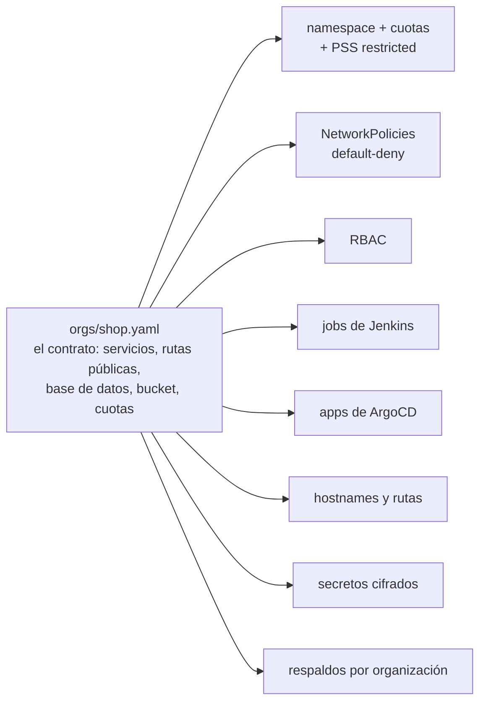

# aegis-infra

**Haces `git push`. Tu servidor construye, escanea, firma y publica.**

Read this in English: [README.en.md](README.en.md)


aegis-infra convierte una máquina Linux y una cuenta de GitHub en una
plataforma de despliegue propia. Un solo comando, `aegis init`,
instala Kubernetes (k3s), ArgoCD, Jenkins, un registro de imágenes, el
escáner de vulnerabilidades, la firma de imágenes y la observabilidad,
y los deja conectados entre sí. Desde ese momento, cada push a un repo
de aplicación se construye en un pod sin privilegios, se escanea, se
firma por digest, se despliega por GitOps y se expone a internet con
TLS. Una imagen sin firma no entra al clúster: se rechaza en la
admisión, no se descubre después.

Se parece a lo que hace un servicio como Vercel, con una diferencia:
el servidor, los datos y las llaves son tuyos.

**Estado: avance técnico (`v3.0.0-alpha.1`).** Es la versión para
desarrolladores y gente de plataforma. La instalación completa ya
corrió de principio a fin en una máquina que no era la del autor (ver
[Dónde se probó](#dónde-se-probó)), y cada afirmación de este
documento sale de una comprobación que se puede volver a ejecutar.
Falta pulirlo, y falta una capa más amigable para quien no quiere
leer un Jenkinsfile. Esa capa es lo próximo, y se construye encima de
esta.

---

## Empezar en cinco pasos

```bash
git clone https://github.com/MEMEMEMEMEMEMEDev/aegis-infra && cd aegis-infra
./bin/aegis preflight      # deja la máquina lista, o dice qué falta
gh auth login              # tu cuenta de GitHub: el init crea los repos por ti
tmux new -s aegis          # la corrida es larga; que un ssh caído no la mate
./bin/aegis init           # el asistente pregunta lo que no puede inferir, y luego dieciséis fases
```

Antes de sentarte, decide dónde vas a guardar la clave age (la fase
10 la muestra una sola vez) y, si vas a usar Cloudflare, ten a mano
una zona y una credencial con la que crear tokens. Los detalles están
en [Qué tener listo](#qué-tener-listo); cada paso, en
[Empezar](#empezar).

## En dos minutos

| | |
|---|---|
| **Qué es** | Un instalador por fases (`aegis init`) que levanta k3s, ArgoCD, Jenkins, un registro de imágenes con su propia PKI, Kyverno, cosign, Trivy, Traefik y observabilidad, y los deja hablándose entre sí. |
| **Para quién** | Un equipo y sus proyectos, en su propio hardware o en un VPS. No sirve para una flota de clústeres, y todavía pide leer configuración. |
| **Qué obtienes** | Cadena de suministro completa (build sin privilegios, escaneo, firma, admisión obligatoria), aplicaciones dadas de alta desde un contrato YAML, observabilidad con alertas al teléfono, respaldos y rotación de credenciales ya ensayados, y `aegis destroy` para deshacerlo todo. |
| **Cómo sabes que funciona** | Cada paso del instalador registra una puerta: una comprobación con resultado guardado. 147 checks estáticos verifican el repositorio sin necesidad de clúster, y cada uno tiene un diente, una mutación que demuestra que el check falla cuando debe. `aegis check` hace lo mismo contra el clúster vivo. Nada que no se haya podido medir cuenta como éxito. |

## Requisitos

| | |
|---|---|
| **Host** | Linux con `sudo`. Se ha corrido en Ubuntu; el playbook que prepara el host exige Ubuntu 24.04 o superior con systemd. El preflight configura `sudo` sin contraseña, instala con `apt` tmux, python3-yaml y jq (y `gh` si falta), y exige que curl, git y python3 ya estén. |
| **Recursos** | 4 CPU y 8 GB de RAM alcanzan (el preflight avisa por debajo de 7 GB). 25 GB libres en `/` y `/dev/shm` escribible. |
| **Red** | Salida a internet por IPv4: el preflight sondea github.com, api.github.com, api.cloudflare.com, get.k3s.io, dl.k8s.io y Docker Hub. Reloj en hora (menos de 120 s de diferencia con GitHub) e IPv6 apagado; el preflight se encarga de las dos cosas. |
| **GitHub** | Una cuenta con `gh auth login` hecho e identidad git configurada (`user.name`, `user.email`). Más abajo, lo que el init hace con ella. |
| **Cloudflare (opcional)** | Una cuenta con una zona, para el perfil `cloudflare`: hostnames públicos, túnel y TLS de Let's Encrypt. Sin ella, el perfil `local` da la misma plataforma sobre nombres que resuelven al host, con TLS de la CA propia de la instancia. |

Un host con restos de otra instancia también funciona (está medido);
el init avisa si los encuentra.

## Qué tener listo

Para probarlo completo hacen falta GitHub y Cloudflare. Sin Cloudflare,
el perfil `local` levanta la plataforma entera (build, escaneo, firma,
admisión, GitOps, observabilidad) sobre nombres que resuelven al host,
y las puertas del borde público, unas veinte, quedan registradas como
no evaluables. Es una buena primera corrida; no es la corrida completa.

- **GitHub.** El preflight dice qué permisos pide la sesión de `gh`
  (`repo` y `delete_repo`). El init crea y administra dos repos con
  nombres nuevos, el de plataforma y el canario, y después uno por
  cada aplicación; las deploy keys y los webhooks también los crea él.
  Una cuenta u organización dedicada es lo más cómodo.
- **Cloudflare, solo para el perfil `cloudflare`.** Una zona en tu
  cuenta (un dominio con sus nameservers en Cloudflare), el ID de
  cuenta y el ID de zona (el asistente los pide), y una credencial
  maestra con la que el init crea sus dos tokens acotados: la Global
  API Key, o un token de cuenta con el permiso «Account API Tokens:
  Edit». Esa credencial vive solo en memoria durante la fase 15. Si la
  pasas por archivo (`CF_MASTER_FILE`), destrúyelo al terminar; el
  init te lo recuerda.
- **Un lugar seguro para la clave age, decidido antes de empezar.** Es
  la raíz de confianza: descifra todo, y perderla es perder todo lo
  cifrado, incluidos los respaldos de estado. La fase 10 la genera, la
  muestra una sola vez y exige un respaldo que valida cifrando y
  descifrando de verdad. Ten decidido dónde va (gestor de contraseñas,
  USB, papel) y que no sea el mismo host. Y no grabes la sesión
  (`script`, `tmux pipe-pane`, asciinema) durante esa fase.
- **Sin operador delante** (`--non-interactive`): `AEGIS_AGE_BACKUP_FILE`
  para el respaldo de la clave y `CF_MASTER_FILE` para la credencial de
  Cloudflare. Sin ellos el init se niega a correr.
- **Un correo de contacto** para los certificados; el asistente lo saca
  de `git config`.

Lo que no hace falta preparar: claves de cosign, certificados, registros
DNS, el túnel, las credenciales del registro interno. Todo eso lo genera
el init, y `aegis rotate` lo puede rotar después.

## Empezar

Los cinco comandos de arriba son toda la instalación. Lo que sigue es
lo que conviene saber mientras corren.

En adelante este documento escribe `aegis` a secas; es `./bin/aegis`
desde el checkout, y `aegis --help` es el mapa de comandos.

**Cuánto tarda.** Horas, no minutos. Depende de la máquina y de la
conexión; la fase larga es la 80, que espeja y construye las imágenes
de la plataforma. Por eso el tmux.

**Dónde queda cada cosa.** Este checkout es el producto y no se escribe
durante una corrida. La instancia, lo que pertenece a esta máquina,
vive en `~/aegis` (o donde apunte `AEGIS_HOME`): la configuración en
`aegis.conf`, el checkout del repo de plataforma en `platform/`, los
marcadores de fase y las puertas en `.init-state/`, y el almacén
cifrado en `.state-secrets/`.

**Lo que pregunta el asistente.** Solo lo que no puede deducir: el
perfil de borde (`cloudflare` o `local`), los nombres de los dos repos
que va a crear, el dominio raíz (en `local` propone uno de sslip.io),
el contexto de kubectl, el ClusterIP del registro interno y el
directorio de trabajo para direnv. Con `cloudflare` pide además el ID
de cuenta y el de zona; con `local`, en qué dirección escucha el
puente. El dueño de GitHub lo toma de la sesión de `gh` y el correo de
contacto de `git config`. Al final muestra un resumen, pide
confirmación y escribe `aegis.conf`.

### Cuando termina

La fase `10-age-ceremony` te habrá mostrado un secreto, el único de
toda la corrida: la clave age, en `~/.config/sops/age/aegis.key`. Es
la raíz de confianza de la instancia. Guárdala donde el init te indica;
sin ella no se lee nada de lo que sigue.

Las consolas cuelgan del dominio raíz: `argocd.`, `jenkins.`,
`grafana.` y `ntfy.<dominio>`. En `aegis.<dominio>` vive el canario,
la primera aplicación que la propia plataforma construyó, firmó y
desplegó. Con el perfil `cloudflare` las consolas quedan detrás de
Cloudflare Access. Con `local`, los nombres resuelven al host vía
sslip.io y el certificado lo firma la CA de la instancia, así que el
navegador avisará hasta que la importes.

Las contraseñas de administración no se imprimen. Nacen cifradas en el
almacén, `~/aegis/.state-secrets/`, en archivos como
`jenkins_admin_pass.enc`, `grafana_admin_pass.enc` y
`argocd_admin_pass.enc`. Se leen con la clave age:

```bash
export SOPS_AGE_KEY_FILE=~/.config/sops/age/aegis.key
sops -d --input-type binary --output-type binary ~/aegis/.state-secrets/jenkins_admin_pass.enc
```

Y en adelante, la rutina:

```bash
aegis check               # mide el clúster vivo contra lo declarado; no escribe nada
aegis init --list         # qué fases hay y cuáles pasaron
```

<details>
<summary><b>Si se cae</b></summary>

Cuando una fase falla, el init se detiene en ella y deja su puerta
registrada. Arregla la causa y reanuda:

```bash
aegis init --from 30      # reanuda desde la fase 30 (las anteriores ya pasaron)
aegis init --only 60      # repite una sola fase
aegis init --check        # mide sin cambiar nada
aegis init-log            # lo mismo que init, dejando un dosier completo de la corrida
```

`aegis init-log` imprime la ruta del dosier antes de empezar, para que
la conozcas aunque la corrida muera. La caja negra es
`.init-state/gates.jsonl`; `docs/OPERATE.md` explica por dónde empezar
a diagnosticar.

Para empezar de cero sobre el mismo host:

```bash
aegis destroy             # sin --yes solo dice qué quitaría
aegis destroy --yes --k3s # quita el borde, el puente y el clúster
aegis init --reset-state  # olvida todas las puertas y vuelve a empezar
```

`aegis destroy` no borra los repos de GitHub: llevan un topic que los
marca como propios del init, y una nueva corrida los reutiliza.

</details>

## Dar de alta una aplicación

Hay una plantilla, `base`: un servicio HTTP mínimo en Go con su
contrato, un `Containerfile` que corre sin root, overlays de kustomize
y el script que escribe el digest. El `Jenkinsfile` no vive en la
plantilla; `aegis org` lo genera desde el canónico.

Todo ocurre en el repo de plataforma de la instancia. Ahí viven los
contratos, en `orgs/`, y ahí se hace el commit.

```bash
cd ~/aegis/platform
aegis app new shop --template base   # escribe contrato, esqueleto, derivaciones y secretos; no toca nada fuera
git diff                             # lee lo que generó
git add -A && git commit -m "org: shop" && git push
aegis sync root                      # ArgoCD recoge la organización nueva
aegis app apply shop                 # crea el repo, la deploy key y el webhook en GitHub
```

`aegis app apply --check` muestra lo que haría sin tocar nada. Desde el
primer push al repo de la aplicación, la plataforma la construye,
escanea, firma, despliega y expone. La plantilla se usa una sola vez:
desde ahí el contrato y el repo son tuyos y los editas a mano. Para
cambiar algo de la organización, editas el contrato y vuelves a
generar:

```bash
$EDITOR orgs/shop.yaml               # añadir postgres, un bucket, otro servicio
aegis org plan orgs/shop.yaml        # qué cambiaría, sin escribir
aegis org apply orgs/shop.yaml       # escribe los manifiestos
aegis secret create orgs/shop.yaml   # si aparecieron secretos nuevos
```

`seed/platform/docs/platform-for-developers.md` es la página para el
equipo que va a hacer push: qué pasa con cada push y qué reglas lo
rechazan.

## Cómo funciona

### Las dieciséis fases, en cuatro etapas



Cada fase deja un marcador y registra sus puertas en
`.init-state/gates.jsonl`. Volver a ejecutar converge: una fase que ya
pasó no se repite, salvo que `--from` o `--only` lo pidan. El orden
importa: la política de admisión se activa cuando ya existe una imagen
firmada que admitir, la observabilidad va al final porque mide lo que
ya existe, y los secretos entran antes que los charts que los usan.

<details>
<summary><b>Las dieciséis fases, una por una</b></summary>

| fase | qué hace |
|---|---|
| `00-preflight` | Comprueba las precondiciones y muestra los límites conocidos. Lanza el asistente de configuración si no hay `aegis.conf`. Si falta algo, aborta aquí y no a mitad del clúster. |
| `05-host` | Instala en el host las herramientas con versión fijada (tofu, sops, age, kubectl, helm, cosign, direnv, jq, git, openssl, y `gh`, del que solo exige que esté y tenga sesión), leyendo las versiones de `group_vars/all.yml` y esperando el lock de apt si hace falta. |
| `10-age-ceremony` | Genera la clave age, la valida cifrando y descifrando de verdad, exige respaldo y escribe `.sops.yaml`. Es la única fase que muestra un secreto al operador. |
| `12-workrepos` | Crea y siembra en GitHub, con `gh`, los dos repos del init (plataforma y canario), marcados con un topic. Si ya existen, los reutiliza; si un repo existe sin la marca, pregunta antes de marcarlo, y sin terminal se niega. |
| `15-third-parties` | Credenciales de terceros sin pasar por el navegador: deploy keys, HMAC de los webhooks y credencial de CI desde la sesión de `gh`. Con el perfil `cloudflare`, crea además los tokens acotados de Cloudflare. |
| `20-k3s` | Prepara el kernel del host e instala k3s con versión fijada, con los playbooks de Ansible del repo de plataforma. |
| `25-edge-tofu` | Levanta el borde. Con `cloudflare`: túnel, DNS y Access con OpenTofu. Con `local`: un puente de systemd en el host que entrega los puertos 80 y 443 a Traefik. |
| `30-argocd` | Instala ArgoCD con helm (la única instalación imperativa) y crea con kubectl los Secrets de arranque, entre ellos la clave age para KSOPS. |
| `35-gitops` | Entrega el control a GitOps: AppProjects, App raíz y sincronizaciones en orden (cert-manager, PKI, Traefik, cloudflared). |
| `40-registry-pki` | Registro interno de imágenes con PKI propia y TLS desde el primer día; credenciales derivadas de un único origen e instalación de la CA en el host. |
| `50-jenkins` | Jenkins con jobs definidos en código desde el primer arranque y secretos creados antes que el chart. Termina con la imagen de herramientas de CI construida y publicada. |
| `60-webhook` | Comprueba de extremo a extremo que un push llega a Jenkins, con una puerta por eslabón: borde, hook, entrega, el build existe, el build está verde. Con `local`, hook y entrega quedan como no evaluables y el build se mide por sondeo. |
| `70-deploy-auto` | Despliegue automático del canario: el pipeline escribe el digest en el overlay y ArgoCD despliega. Antes de escribir nada prueba el anti-bucle: un commit que solo toca k8s no dispara un build. |
| `80-supply-chain` | Servidor Trivy, clave cosign y política Kyverno en modo Enforce, activada al final, cuando ya existe la primera imagen firmada. |
| `85-observability` | Sobre todo lo anterior: VictoriaMetrics, vmalert, Grafana, sondas y bitácora de eventos, con un latido que llega al topic de ntfy. |
| `87-ai` | El subsistema de AI, si se pidió. `AI=no` la salta dejando escrito el motivo y sus puertas sin sujeto; `AI=cpu` levanta pasarela, controlador y el motor pequeño, sin tarjeta; `AI=gpu` mide el driver y el runtime del host antes de tocar nada. Los motores nacen apagados. Un valor que no reconoce no lo trata como «no»: se detiene, porque adivinar cuál quiso decir es como un subsistema queda desplegado a medias. |

</details>

### Producto e instancia son dos cosas


Un solo archivo decide dónde vive cada cosa, con una copia en bash y
otra en python, para que dos comandos no puedan discrepar. Lo que no
está en `seed/` no se distribuye: el repo de plataforma de cada
instancia nace de esa semilla, con marcadores de posición en lugar de
valores.

### Un contrato, y todo lo demás derivado



`aegis org apply` vuelve a generar todo desde el contrato, en bloques
marcados que se reescriben enteros: nada se escribe dos veces a mano.
`aegis org plan` muestra qué cambiaría antes de tocar nada.

### La cadena de suministro, paso a paso

1. Un push llega a Jenkins por webhook (o por sondeo con el perfil
   `local`).
2. kaniko construye la imagen en un pod sin privilegios. El
   Containerfile de la plantilla corre sin root bajo PSS restricted.
3. Trivy escanea con `--exit-code 1 --severity CRITICAL,HIGH
   --ignore-unfixed`: una vulnerabilidad corregible de esa severidad
   detiene el build.
4. cosign firma por digest, nunca por tag, con la clave de la
   instancia.
5. El pipeline escribe el digest en el overlay de kustomize
   (`ci/write-digest.mjs`) y hace commit. ArgoCD despliega.
6. Kyverno (`require-aegis-signature`, en Enforce, con `mutateDigest`)
   rechaza en la admisión cualquier imagen sin firma válida.

Las imágenes de la propia plataforma siguen la misma disciplina. El job
`mirror-images` trae de fuera solo versiones fijadas, `ci-images`
construye la imagen de herramientas de CI, `base-images` fabrica las
bases propias, e `image-watch` vuelve a escanear todo cada día (cron
`H 6 * * *`). `aegis ci build` dispara los cuatro en ese orden;
`aegis ci digests` lista `imagen@digest` para leerlo antes de cambiar
un `FROM` a mano.

### Las reglas que ordenan todo lo demás

- **El contrato es la única fuente de verdad.** Las plantillas generan
  contratos; de los contratos se deriva todo lo demás, siempre igual.
- **Converger, no ejecutar.** Un comando que se vuelve a correr con el
  trabajo ya hecho termina en «nada que hacer».
- **Cuatro salidas, siempre.** `0` hecho o ya estaba; `1` mal o falta;
  `2` no se pudo evaluar; `3` uso inválido. «No se pudo evaluar» es una
  respuesta con todas las letras: un instrumento que nunca llegó a su
  sujeto no dice que el sujeto esté bien.
- **El silencio nunca es éxito.** Una puerta sin sujeto se registra como
  tal; un build que nunca apareció es un fallo; un asistente que no pudo
  escribir el archivo se detiene en vez de seguir.
- **Un check que no muerde no existe.** Cada check viene con la mutación
  que demuestra que falla cuando debe (`aegis verify --teeth`).
- **El producto no nombra máquinas ni personas.** Dos checks mantienen
  fuera direcciones e identidades, para que lo que se instala aquí se
  instale en cualquier parte.


## Los comandos

`aegis --help` imprime el menú y `aegis <cmd> --help` el detalle de cada
uno. Todos devuelven los mismos cuatro códigos de salida, salvo
`aegis verify`, que usa 0, 1 y 3 (el 3 señala un defecto del propio
verificador).

| grupo | comandos |
|---|---|
| setup | `aegis preflight`, `aegis init`, `aegis init-log`, `aegis verify`, `aegis destroy` |
| apps | `aegis app`, `aegis org`, `aegis secret` |
| operate | `aegis check`, `aegis sync`, `aegis ai` |
| infra | `aegis ci`, `aegis edge`, `aegis registry`, `aegis rotate`, `aegis webhook` |
| backup | `aegis data`, `aegis state` |

<details>
<summary><b>Cada comando, en una línea</b></summary>

**setup**

| comando | qué hace |
|---|---|
| `aegis preflight` | Deja la máquina en el estado que el init necesita: sudo sin contraseña, IPv6 apagado, DNS, reloj, paquetes, identidad git. Sin argumentos actúa y repara. |
| `aegis init` | El orquestador: levanta la plataforma fase por fase y registra una puerta por paso. Volver a correrlo converge. Flags: `--from N`, `--only N`, `--check`, `--configure`, `--list`, `--reset-state`, `--non-interactive`. |
| `aegis init-log` | Ejecuta `aegis init` bajo `script`, dejando un dosier completo de la corrida. Acepta los mismos flags. |
| `aegis verify` | Verificación estática del repositorio, sin clúster: los checks de `verify/checks/`. Flags: `--profile cloudflare\|local\|both`, `--only NNN`, `--teeth [NNN]` (prueba que cada check muerde), `--harness` (los arneses funcionales), `--with-charts`, `--list`. |
| `aegis destroy` | Deshace la huella del init en el borde y en este host; con `--k3s` también el clúster; con `--purge-secrets`, el almacén de la instancia. Sin `--yes` solo dice qué haría. No borra los repos de GitHub. |

**apps**

| comando | qué hace |
|---|---|
| `aegis app new` / `apply` | `new` escribe el alta entera en archivos (contrato desde una plantilla con `--template`, esqueleto, derivaciones, secretos) sin tocar nada fuera; `apply` ejecuta los pasos de GitHub de cada contrato: repo, esqueleto, deploy key, webhook (`--check` para verlo sin tocar nada). |
| `aegis org plan` / `apply` / `validate` / `edge` / `routes` / `plan-delete` / `delete` / `migrate` | `plan` muestra qué cambiaría; `apply` escribe los manifiestos; `validate` solo valida el contrato; `edge` deriva los hostnames públicos de todos los contratos; `routes` deriva el ConfigMap de rutas de IA (`ai-ruteo`); `plan-delete` muestra qué borraría; `delete` borra del repo y dice qué retirar del clúster; `migrate` lleva un contrato a una versión nueva. |
| `aegis secret create` / `rotate` / `move` | Crea los secretos cifrados que faltan (nunca regenera los que existen), reemplaza el material, o copia un secreto a otro namespace (`move` necesita la clave age). |

**operate**

| comando | qué hace |
|---|---|
| `aegis check` | La ronda rutinaria. Sin argumentos y sin escribir nada: mide el clúster vivo contra lo declarado (firma en Enforce, respaldos por organización, desincronías). |
| `aegis sync` | Dispara un sync de ArgoCD de las apps nombradas sin pasar `syncOptions`; `--drifted` sincroniza todo lo que no esté Synced. |
| `aegis ai` | El control del operador sobre el sustrato de IA; queda fuera de este documento. |

**infra**

| comando | qué hace |
|---|---|
| `aegis ci build` / `jobs` / `digests` | `build` dispara los jobs de imágenes de la plataforma en orden (`mirror-images`, `ci-images`, `base-images`, `image-watch`) y espera a cada uno, y también dispara por nombre cualquier otro job que el job-dsl declare; `jobs` lista los jobs derivados de ese job-dsl sin hablar con el clúster; `digests` lista `imagen@digest` de lo que guarda el registro interno. |
| `aegis edge check` | Compara los hostnames vivos con los derivados de los contratos. |
| `aegis registry check` / `rotate` | `check` verifica que la credencial del registro interno esté alineada en sus diez destinos; `rotate` la genera de nuevo y reescribe los diez. |
| `aegis rotate list` / `check` / `run` / `continue` | El protocolo de rotación hecho comando: inventario, comprobar si una credencial funciona sin rotarla, rotar con el radio de impacto a la vista, y reanudar un lote interrumpido. |
| `aegis webhook check` / `apply` | Mide que todo repo con job tenga webhook; crea los que faltan resincronizando el HMAC. |

**backup**

| comando | qué hace |
|---|---|
| `aegis data backup` / `list` / `restore` | Los datos de los tenants: un bundle por organización. `list` mira dentro sin restaurar; `restore` exige `--org` y, si la credencial rotó desde la captura, `--force`. |
| `aegis state backup` / `restore` | Los tres estados que viven solo en esta máquina y que ningún git guarda: el almacén cifrado, los marcadores de fase y el tfstate del borde. Perder cualquiera obliga a rehacer la instalación a mano. |

`state` es la máquina: lo que hace falta para reconstruir la
instalación. `data` son los tenants: lo que hace falta para reconstruir
sus aplicaciones y sus datos. El respaldo de uno no restaura el otro.

</details>

## Dónde se probó

El entorno: un VPS alquilado (4 CPU, 16 GB, Ubuntu, nada instalado
salvo ssh), una cuenta de GitHub nueva y sin dominio (perfil `local`).
Es decir, sin nada de lo que el autor tiene a mano en su propia
máquina. Todo lo de abajo ocurrió ahí el 2026-08-27, y la tabla
completa, puerta por puerta, está en
`docs/journeys/foreign-instance.md`.

Las cifras de abajo son de esa corrida y se dejan como salieron. Dicen
15 de 15 fases porque entonces eran quince: la fase 87, la del
subsistema de AI, llegó el 2026-08-29. Corregirlas para que cuadren con
el producto de hoy sería inventar una medición que nadie tomó.

- **Instalación desde cero:** 15 de 15 fases, 174 puertas pasadas, 20
  registradas como no evaluables (necesitan un borde público).
- **Dos aplicaciones dadas de alta desde su contrato**, con sus datos
  restaurados desde respaldos (12 productos, 4 pedidos) y su catálogo
  servido por HTTPS.
- **Cadena de suministro de extremo a extremo:** imagen firmada
  admitida; imagen sin firma rechazada citando la política; espejo y
  vigilancia diaria sin CVEs corregibles.
- **Respaldo y restauración del estado** en un segundo directorio de
  instancia: ida y vuelta verificada.
- **Destruir y reinstalar sobre los restos:** `aegis destroy --k3s` y
  un segundo `aegis init` sobre el mismo host sucio, 15 de 15 fases.
  Lo que una instancia anterior deja atrás (una política de admisión
  heredada, una CA vieja, un registro que ya no existe) ahora lo
  detecta y lo repara el propio init.

Esa primera corrida en máquina ajena necesitó catorce reanudaciones
(`aegis init --from`) y sacó a la luz unos treinta defectos que los
checks estáticos no podían ver: errores de la distancia entre el
producto y su primera instancia real. Están todos cerrados, cada uno
con su check, y sus clases tienen nombre en
`seed/platform/docs/failure-modes.md`.

Lo que todavía no se ha medido: el perfil `cloudflare` en una máquina
ajena. Con el perfil `local` sus puertas quedan registradas como no
evaluables.

## Qué hay dentro

```
bin/          el despachador (aegis <comando>)
libexec/      un archivo por comando
lib/          los helpers compartidos, bash y python
init/         el orquestador y sus dieciséis fases
verify/       los checks, sus dientes, los arneses
seed/         lo que se distribuye: el repo de plataforma, el canario, las plantillas
share/        los códigos de salida y las unidades de systemd
docs/         AGENTS.md (cómo cambiar esto), OPERATE.md (cómo operarlo),
              el glosario, los journeys de diseño
```

Lo que corre en el clúster: k3s v1.35.4+k3s1 (sin el Traefik ni el
servicelb de fábrica), instalado por Ansible; ArgoCD con KSOPS; Jenkins
con jobs en código y kaniko; Trivy, cosign y Kyverno; Traefik y
cert-manager con CA interna; cloudflared solo con el perfil
`cloudflare`; un registro interno de imágenes con TLS de la PKI propia;
Garage (S3) y Postgres 17 como tipos de servicio, con un bucket y una
base de datos por organización; VictoriaMetrics, VictoriaLogs, Grafana,
Vector, blackbox-exporter, Alertmanager y ntfy; NetworkPolicies por
tenant (default-deny con salida DNS) y PSS restricted en el canario y en
cada namespace de tenant. En el host: sops 3.9.4 y age 1.2.1 para el
almacén cifrado, y OpenTofu 1.12.3 solo para el borde de Cloudflare
(túnel, DNS y Access).

Por dónde empezar a leer:

- `docs/AGENTS.md`, si vas a cambiar el producto: el método, las reglas
  que nacieron de incidentes reales, dónde vive cada cosa.
- `docs/OPERATE.md`, si vas a operar una instancia: estado esperado,
  diagnóstico, qué desincronías son inofensivas, herramientas de
  recuperación.
- `docs/glossary.md` es el vocabulario, y `aegis verify` lo hace
  cumplir.
- `docs/journeys/foreign-instance.md` es el ensayo en máquina ajena,
  escrito para poder repetirlo.
- `seed/platform/docs/failure-modes.md` cataloga las clases de fallo
  (de la A a la H) con su firma y su arreglo.
- `seed/platform/docs/platform-for-developers.md` es lo que lee el
  equipo que hace push.

## Lo que no está

Dicho claro, porque los checks lo dirían igual.

- El perfil `cloudflare` no se ha corrido en una máquina ajena.
- Un arreglo en la semilla no llega a una instancia ya sembrada;
  volver a sembrar una instancia viva es manual.
- `aegis data restore` restaura la base de datos, no los objetos del
  bucket (lo avisa al correr). Restaurar entre instancias no es
  automático: el bundle viene cifrado con la clave age de la instancia
  que lo hizo, hay que recifrarlo con la clave de la nueva, y `restore`
  exige `--force` porque detecta que la credencial de la base de datos
  cambió. Tras `--force`, el rol de la base de datos se realinea a
  mano.
- Una sola plantilla de aplicación (`base`). Una plantilla de sitio
  estático y un Jenkinsfile para varios servicios están diseñados, no
  distribuidos.
- `aegis secret create` no deriva la copia por namespace de la
  credencial del registro; `aegis secret move` lo hace, con la clave
  privada.
- Kyverno solo alcanza registros firmados por la CA de la instancia;
  una imagen pública se rechaza con un error `x509`, no con «sin
  firma».
- Un solo nodo. Sin HA ni multiclúster: es una plataforma para un
  equipo y sus proyectos, no para una flota. En reposo reserva unas
  2,5 CPU; un nodo de 4 CPU admite un build a la vez.
- Algunos identificadores dentro de la semilla siguen en español a
  propósito: cada uno se mueve con la instancia que lo lee, y el
  glosario lista los pendientes.
- Exige leer. La capa más amigable es la próxima pieza de trabajo, y se
  construye encima de esta, no en su lugar.

Lo próximo, en este orden y sin fechas: la capa amigable para personas
no técnicas y para desarrolladores que recién empiezan; el perfil
`cloudflare` en una máquina ajena, con sus puertas pasando de no
evaluables a medidas; más plantillas de aplicación.

## Sobre el idioma y el historial

El producto está en inglés: código, identificadores, mensajes, la
semilla y la documentación interna (`docs/`, `seed/platform/docs/`).
`docs/glossary.md` decide qué palabra inglesa representa cada idea, y
un check lo hace cumplir. Este README en español es la página principal
por ahora; `README.en.md` es la versión en inglés, y la intención es
que toda la documentación pública termine en inglés. El historial de
commits está en español a propósito: es registro de trabajo, no
producto, y se conserva tal cual porque cuenta cómo se encontró cada
bug.

Este historial empieza con la reconstrucción v3 y cuenta solo esa
parte. El grueso del trabajo anterior (la versión 2, que sigue
corriendo la instancia del autor, sus repos de plataforma y las
sesiones que la precedieron) vive en repositorios privados, porque
lleva la identidad de una instancia concreta. Quizá algún día se
libere. Lo que sí conviene saber: este proyecto no salió de una sola
sesión ni de un prompt; cada pieza de arriba tiene detrás corridas que
fallaron y checks que nacieron de ellas.

## Contribuir, seguridad, licencia

- `CONTRIBUTING.md`: el método es corto y no se negocia. Un ítem, un
  commit; un check por cada arreglo; un diente por cada check;
  `aegis verify --profile both` en verde antes de hacer commit, y
  `--teeth NNN` para los checks que tocaste. Nada está hecho hasta que
  una corrida lo valida en una instancia real.
- `SECURITY.md`: cómo reportar una vulnerabilidad en privado, con el
  reporte privado de GitHub de este repositorio (Security, Report a
  vulnerability), nunca por un issue público.
- Licencia Apache, versión 2.0; ver `LICENSE`.
