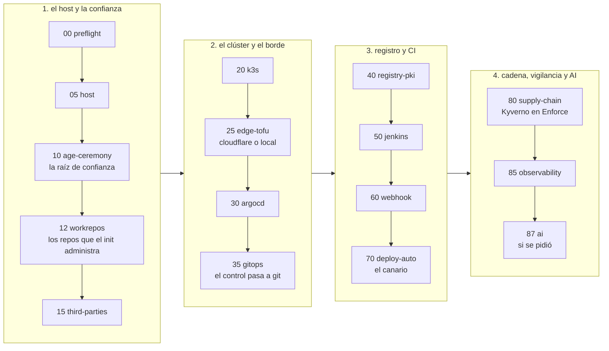
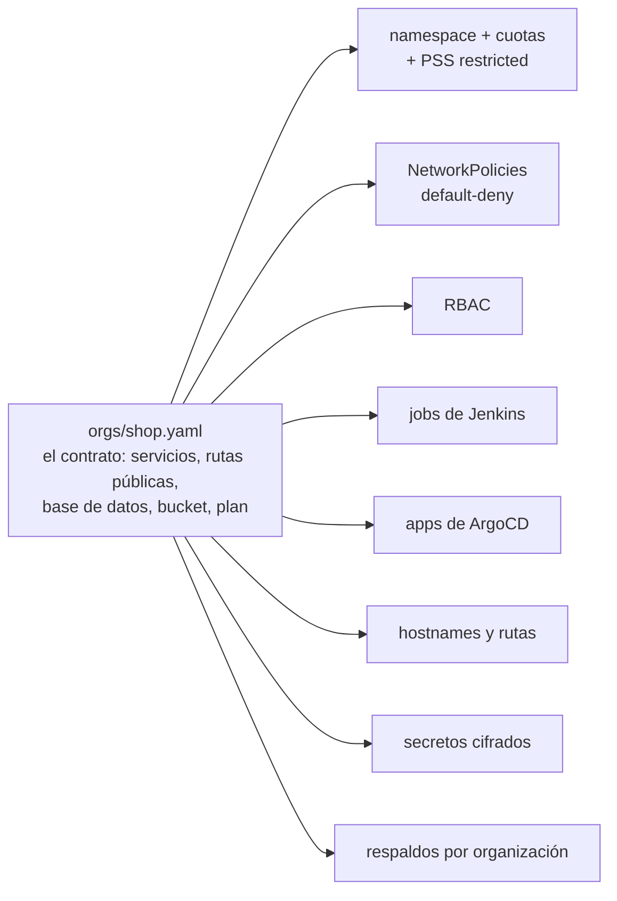
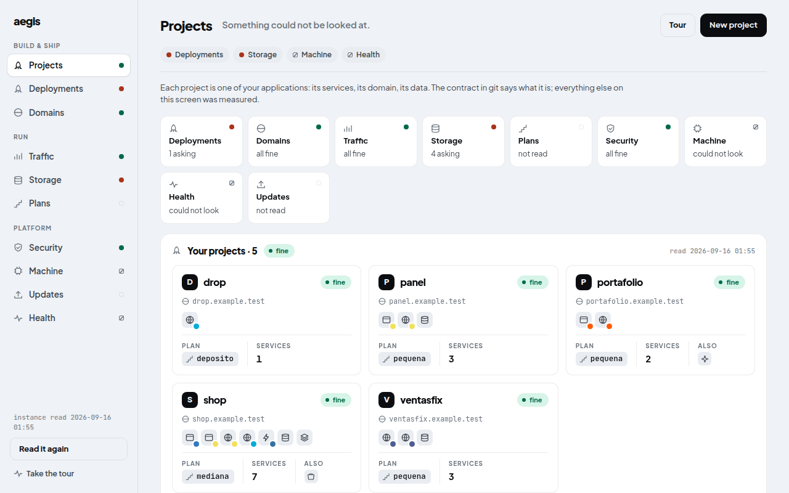
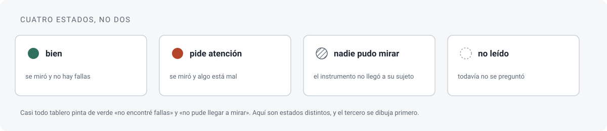
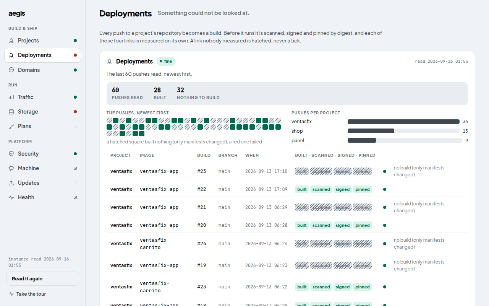

# aegis

**Haces `git push`. Tu servidor construye, escanea, firma y publica.**

[](https://github.com/MEMEMEMEMEMEMEDev/aegis-infra/actions/workflows/verify.yml)
· Read this in English: [README.en.md](README.en.md)


aegis convierte una máquina Linux y una cuenta de GitHub en una
plataforma de despliegue propia. Un comando, `aegis init`, instala
Kubernetes (k3s), ArgoCD, Jenkins, un registro de imágenes, el escáner
de vulnerabilidades, la firma de imágenes y la observabilidad, y los
deja conectados. Desde ahí, cada push a un repositorio de aplicación se
construye en un pod sin privilegios, se escanea, se firma por digest,
se despliega por GitOps y sale a internet con TLS. Una imagen sin firma
no entra al clúster.

Para quien hace push, la experiencia se parece a Vercel, con una
diferencia: el servidor, los datos y las llaves son tuyos. Para quien
la opera, hoy es una herramienta de platform engineering: la consola
para el equipo de producto todavía no existe.

**Estado: avance técnico (`v3.0.0-alpha.1`).** Es una versión para
desarrolladores y gente de plataforma. La instalación completa ya corrió
de principio a fin en una máquina ajena (ver [Dónde se
probó](#dónde-se-probó)) y cada afirmación de esta página sale de una
comprobación que se puede repetir. Falta pulir. Hay una consola visual
para el operador; la consola del inquilino todavía no existe.

---

## Qué obtienes

- **Una plataforma desde un comando.** `aegis init` corre dieciséis
  fases. Volver a correrlo no repite lo que ya pasó.
- **Una cadena de suministro completa.** Build sin privilegios (kaniko),
  escaneo (Trivy), firma por digest (cosign) y admisión obligatoria
  (Kyverno). Las imágenes de la propia plataforma siguen la misma regla.
- **Aplicaciones desde un contrato.** Un YAML por organización. De ahí
  se derivan namespace, cuotas, políticas de red, RBAC, jobs, apps de
  ArgoCD, hostnames, secretos y respaldos.
- **Observabilidad con alertas al teléfono.** VictoriaMetrics, Grafana,
  sondas y bitácora, con avisos por ntfy. Hay un latido: si la
  plataforma deja de avisar, eso también es un aviso.
- **Recuperación ensayada.** Respaldo y restauración del estado y de los
  datos, rotación de cada credencial que el init genera, y `aegis
  destroy` para deshacerlo todo.
- **Un verificador.** 247 checks estáticos miden este repositorio sin
  clúster (`aegis verify --list` los cuenta). Cada uno lleva su
  *diente*: una mutación que demuestra que el check falla cuando debe.
  `aegis check` hace lo mismo contra el clúster vivo.

## Antes de empezar

| | |
|---|---|
| **Host** | **Ubuntu 24.04 o superior**, con `sudo`. Otras distribuciones (Arch, CachyOS, Fedora, Debian, Mint, Pop!_OS) se rechazan antes de tocar nada: aegis usa `apt` y los valores por defecto de Ubuntu. |
| **Recursos** | 4 CPU y 8 GB de RAM alcanzan (avisa por debajo de 7 GB). 25 GB libres en `/`. `aegis host measure` mide tu máquina; `aegis host budget` dice si lo que la plataforma reserva entra en lo que la máquina deja. |
| **Si compartes la máquina** | Con sesión gráfica, aegis reserva un piso de memoria para el escritorio y no lo toca. `aegis host floor --set` lo cambia. |
| **GPU (opcional)** | Para el carril de GPU de la AI: una NVIDIA con driver 570 o superior. Se comparte con tu escritorio; `aegis host show` dice cuánta VRAM hay. |
| **Red** | Salida a internet por IPv4, reloj en hora, IPv6 apagado. El preflight sondea y corrige lo que puede. |
| **GitHub** | Una cuenta con `gh auth login` hecho e identidad git configurada. El init crea dos repositorios (plataforma y canario) y después uno por aplicación. Una cuenta u organización dedicada es lo más cómodo. |
| **Cloudflare (opcional)** | Una zona en tu cuenta y **Zero Trust encendido** (gratis, una vez, en one.dash.cloudflare.com), para el perfil `cloudflare`: hostnames públicos, túnel, TLS de Let's Encrypt y las consolas detrás de Access. Sin ella, el perfil `local` levanta la misma plataforma sobre nombres que resuelven al host, con TLS de la CA propia. |

Qué tener a mano:

- **Un lugar seguro para la clave age.** Es la raíz de confianza:
  descifra todo, y perderla es perder todo lo cifrado, respaldos
  incluidos. La fase 10 la genera, la muestra una sola vez y exige un
  respaldo que valida de verdad. Decide antes dónde va (gestor de
  contraseñas, USB, papel) y que no sea el mismo host. No grabes la
  sesión durante esa fase.
- **Con Cloudflare:** el ID de cuenta, el ID de zona y una credencial
  maestra (la Global API Key, o un token con «Account API Tokens:
  Edit»). El init crea con ella sus dos tokens acotados y no la guarda.
- **Sin operador delante** (`--non-interactive`): `AEGIS_AGE_BACKUP_FILE`
  y, con Cloudflare, `CF_MASTER_FILE`.

No hace falta preparar claves de cosign, certificados, registros DNS,
el túnel ni las credenciales del registro interno. Todo eso lo genera
el init.

## Instalar

```bash
git clone https://github.com/MEMEMEMEMEMEMEDev/aegis-infra && cd aegis-infra
./bin/aegis preflight      # deja la máquina lista, o dice qué falta
gh auth login              # tu cuenta de GitHub: el init crea los repos por ti
tmux new -s aegis          # la corrida es larga; que un ssh caído no la mate
./bin/aegis init           # el asistente pregunta lo que no puede inferir, y luego dieciséis fases
```

Tarda horas, no minutos. La fase larga es la 80, que espeja y construye
las imágenes de la plataforma. En adelante esta página escribe `aegis`
a secas: es `./bin/aegis` desde el checkout, y `aegis --help` es el
mapa.

**Lo que pregunta el asistente.** El perfil de borde (`cloudflare` o
`local`), los nombres de los dos repositorios, el dominio raíz y, con
`cloudflare`, los dos ID. El resto lo deduce: el dueño de GitHub de la
sesión de `gh`, el correo de `git config`. Muestra un resumen, pide
confirmación y escribe `~/aegis/aegis.conf`.

**Dónde queda cada cosa.** Este checkout es el producto y no se escribe
durante una corrida. La instancia vive en `~/aegis`: la configuración en
`aegis.conf`, el repositorio de plataforma en `platform/`, los marcadores
de fase y las puertas en `.init-state/`, el almacén cifrado en
`.state-secrets/`.

**Cuando termina.** Las consolas cuelgan del dominio raíz: `argocd.`,
`jenkins.`, `grafana.` y `ntfy.<dominio>`. En `aegis.<dominio>` vive el
canario, la primera aplicación que la plataforma construyó, firmó y
desplegó. Con `cloudflare` las consolas quedan detrás de Cloudflare
Access; con `local`, el navegador avisará hasta que importes la CA. Las
contraseñas de administración nacen cifradas en `~/aegis/.state-secrets/`
y se leen con la clave age:

```bash
export SOPS_AGE_KEY_FILE=~/.config/sops/age/aegis.key
sops -d --input-type binary --output-type binary ~/aegis/.state-secrets/jenkins_admin_pass.enc
```

La rutina, después:

```bash
aegis check               # mide el clúster vivo contra lo declarado; no escribe nada
aegis init --list         # qué fases hay y cuáles pasaron
```

<details>
<summary><b>Si se cae</b></summary>

Cuando una fase falla, el init se detiene en ella y deja su puerta
registrada. Arregla la causa y reanuda:

```bash
aegis init --from 30      # reanuda desde la fase 30
aegis init --only 60      # repite una sola fase
aegis init --check        # mide sin cambiar nada
aegis init-log            # lo mismo que init, dejando un dosier completo de la corrida
```

`aegis init-log` imprime la ruta del dosier antes de empezar. La caja
negra es `.init-state/gates.jsonl`; `docs/OPERATE.md` dice por dónde
empezar a diagnosticar. Si vas a pedir ayuda, manda la línea `fail` de
ese fichero y el dosier.

Para empezar de cero sobre el mismo host:

```bash
aegis destroy             # sin --yes solo dice qué quitaría
aegis destroy --yes --k3s # quita el borde, el puente y el clúster
aegis init --reset-state  # olvida todas las puertas y vuelve a empezar
```

`aegis destroy` no borra los repositorios de GitHub: llevan un topic
que los marca como propios del init, y una nueva corrida los reutiliza.

</details>

Con tu propio dominio en Cloudflare y tu GPU, el viaje completo está en
[docs/journeys/your-machine.md](docs/journeys/your-machine.md): qué
preparar, qué esperar de cada fase y qué mandar cuando algo se frena.

## Tu primera aplicación

Todo ocurre en el repositorio de plataforma de la instancia. Ahí viven
los contratos, en `orgs/`, y ahí se hace el commit.

```bash
cd ~/aegis/platform
aegis app new shop --template base   # escribe contrato, esqueleto, derivaciones y secretos; no toca nada fuera
git diff                             # lee lo que generó
git add -A && git commit -m "org: shop" && git push
aegis sync root                      # ArgoCD recoge la organización nueva
aegis app apply shop                 # crea el repo, la deploy key y el webhook en GitHub
```

Desde el primer push al repositorio de la aplicación, la plataforma la
construye, escanea, firma, despliega y expone. La plantilla se usa una
vez: desde ahí el contrato y el repositorio son tuyos. Para cambiar
algo, editas el contrato y vuelves a derivar:

```bash
$EDITOR orgs/shop.yaml               # añadir postgres, un bucket, otro servicio
aegis org plan orgs/shop.yaml        # qué cambiaría, sin escribir
aegis org apply orgs/shop.yaml       # escribe los manifiestos
aegis secret create orgs/shop.yaml   # si aparecieron secretos nuevos
```

`seed/platform/docs/platform-for-developers.md` es la página para el
equipo que va a hacer push: qué pasa con cada push y qué reglas lo
rechazan.

## Cómo funciona

### Dieciséis fases, cuatro etapas



Cada fase deja un marcador y registra sus puertas en
`.init-state/gates.jsonl`. El orden importa: la política de admisión se
activa cuando ya existe una imagen firmada que admitir, y la
observabilidad va al final porque mide lo que ya existe.

<details>
<summary><b>Las dieciséis fases, una por una</b></summary>

| fase | qué hace |
|---|---|
| `00-preflight` | Comprueba las precondiciones. Lanza el asistente si no hay `aegis.conf`. Si falta algo, aborta aquí y no a mitad del clúster. Con `AI=gpu` mide el driver antes de seguir. |
| `05-host` | Instala en el host las herramientas con versión fijada (tofu, sops, age, kubectl, helm, cosign, direnv, jq, git) verificando el checksum que publica cada autor. Instala los relojes de usuario: respaldo, métricas del host, aviso de actualizaciones. |
| `10-age-ceremony` | Genera la clave age, la valida cifrando y descifrando de verdad, exige respaldo y escribe `.sops.yaml`. Es la única fase que muestra un secreto. |
| `12-workrepos` | Crea y siembra en GitHub los dos repositorios del init (plataforma y canario), marcados con un topic. Si ya existen, los reutiliza. |
| `15-third-parties` | Credenciales de terceros sin pasar por el navegador: deploy keys, HMAC de los webhooks, credencial de CI. Con `cloudflare`, los tokens acotados. |
| `20-k3s` | Prepara el kernel e instala k3s con versión fijada, con Ansible. |
| `25-edge-tofu` | Levanta el borde. Con `cloudflare`: túnel, DNS y Access con OpenTofu. Con `local`: un puente de systemd que entrega los puertos 80 y 443 a Traefik. |
| `30-argocd` | Instala ArgoCD con helm (la única instalación imperativa) y crea los Secrets de arranque, entre ellos la clave age para KSOPS. |
| `35-gitops` | Entrega el control a GitOps: AppProjects, App raíz y sincronizaciones en orden. |
| `40-registry-pki` | Registro interno de imágenes con PKI propia y TLS desde el primer día. |
| `50-jenkins` | Jenkins con jobs definidos en código desde el primer arranque. Termina con la imagen de herramientas de CI construida y publicada. |
| `60-webhook` | Comprueba de extremo a extremo que un push llega a Jenkins, con una puerta por eslabón. |
| `70-deploy-auto` | Despliegue automático del canario: el pipeline escribe el digest y ArgoCD despliega. Antes prueba que un commit que solo toca manifiestos no dispara un build. |
| `80-supply-chain` | Servidor Trivy, clave cosign y política Kyverno en Enforce, activada al final, cuando ya existe la primera imagen firmada. Construye las imágenes base propias. |
| `85-observability` | VictoriaMetrics, vmalert, Grafana, sondas y bitácora, con un latido que llega a ntfy. |
| `87-ai` | El subsistema de AI, si se pidió. `AI=no` lo salta y lo deja escrito; `AI=cpu` levanta pasarela, controlador y un motor pequeño; `AI=gpu` mide driver y runtime antes de tocar nada. Los motores nacen apagados. |

</details>

### Producto e instancia

```mermaid
flowchart LR
    subgraph P["el producto: este repositorio, solo lectura durante una corrida"]
        direction TB
        p1["bin/ libexec/ lib/<br/>los comandos"]
        p2["init/<br/>las dieciséis fases"]
        p3["verify/<br/>247 checks y sus dientes"]
        p4["seed/<br/>lo que se distribuye"]
    end
    subgraph I["la instancia: ~/aegis, estado vivo"]
        direction TB
        i1["aegis.conf"]
        i2["platform/<br/>el repo GitOps, en GitHub"]
        i3[".init-state/<br/>marcadores y puertas"]
        i4[".state-secrets/<br/>el almacén cifrado con age"]
    end
    P -- "aegis init<br/>siembra, instala, mide" --> I
    P -- "aegis seed apply<br/>trae un arreglo de la semilla" --> I
    I -- "aegis check, aegis state backup<br/>aegis data backup, aegis rotate" --> I
```



Un solo archivo decide dónde vive cada cosa, con una copia en bash y
otra en python, para que dos comandos no puedan discrepar. Lo que no
está en `seed/` no se distribuye. Cuando el producto cambia, `git pull`
trae el arreglo a la máquina y `aegis seed apply` lo trae a la
instancia, conservando lo que es suyo.

### Un contrato, y todo lo demás derivado



`aegis org apply` vuelve a generar todo desde el contrato, en bloques
marcados que se reescriben enteros. `aegis org plan` muestra qué
cambiaría antes de tocar nada.

### La cadena de suministro, en seis pasos

1. Un push llega a Jenkins por webhook (o por sondeo, con `local`).
2. kaniko construye la imagen en un pod sin privilegios.
3. Trivy escanea. Una vulnerabilidad corregible de severidad HIGH o
   CRITICAL detiene el build.
4. cosign firma por digest, nunca por tag, con la clave de la instancia.
5. El pipeline escribe el digest en el overlay de kustomize y hace
   commit. ArgoCD despliega.
6. Kyverno, en Enforce, rechaza en la admisión cualquier imagen sin
   firma válida.

Las imágenes de la propia plataforma siguen la misma disciplina: un job
espeja de fuera solo versiones fijadas, otro construye las bases propias
y las prueba arrancándolas antes de firmarlas, y `image-watch` vuelve a
escanear todo cada día.

### Seis reglas

- El contrato es la única fuente de verdad. Todo lo demás se deriva.
- Un comando que se vuelve a correr con el trabajo hecho termina en
  «nada que hacer».
- Cuatro salidas, siempre: `0` hecho o ya estaba, `1` mal o falta, `2`
  no se pudo evaluar, `3` uso inválido. Un instrumento que no llegó a su
  sujeto no dice que el sujeto esté bien.
- Una puerta sin sujeto se registra como tal. Un build que nunca
  apareció es un fallo.
- Cada check viene con la mutación que demuestra que muerde
  (`aegis verify --teeth`).
- El producto no nombra máquinas ni personas. Dos checks lo vigilan.


## La consola

```bash
aegis console serve            # http://127.0.0.1:7391
```



Una capa visual encima del CLI. Cada pantalla se dibuja con los
documentos que los comandos ya emiten; no mide nada por su cuenta y no
puede correr nada que tú no puedas. No tiene agente de AI: una
plataforma cuyo trabajo es decir qué es verdad sobre tu máquina no
adivina.



Está organizada como las consolas que ya conoces: Projects,
Deployments, Domains, Traffic, Storage, Security, Machine y Health, y al
lado de cada entrada el peor estado de lo que la alimenta. Abre con tus
proyectos y con los repositorios que todavía no corre nadie. Da de alta
un proyecto en tres tarjetas y escribe el contrato, los manifiestos y
los secretos que falten. No commitea, no empuja, no aplica y no toca el
clúster: ArgoCD lee el remoto, así que nada corre hasta que tú
commitees.



Trae un recorrido guiado de quince pasos. No se publica por el túnel:
se entra con `ssh -L 7391:127.0.0.1:7391`. El porqué, el modelo de
seguridad y lo que falta están en [docs/console.md](docs/console.md).

## Los comandos

`aegis --help` imprime el menú y `aegis <cmd> --help` el detalle de cada
uno. Todos devuelven los mismos cuatro códigos de salida, salvo
`aegis verify`, que usa 0, 1 y 3.

| grupo | comandos |
|---|---|
| setup | `aegis preflight`, `aegis init`, `aegis init-log`, `aegis verify`, `aegis destroy` |
| apps | `aegis app`, `aegis org`, `aegis quota`, `aegis repos`, `aegis image`, `aegis secret` |
| operate | `aegis check`, `aegis console`, `aegis update`, `aegis tenant`, `aegis traffic`, `aegis capacity`, `aegis builds`, `aegis host`, `aegis sync`, `aegis seed`, `aegis ai` |
| infra | `aegis ci`, `aegis edge`, `aegis registry`, `aegis rotate`, `aegis webhook` |
| backup | `aegis data`, `aegis state` |

<details>
<summary><b>Cada comando, en una línea</b></summary>

**setup**

| comando | qué hace |
|---|---|
| `aegis preflight` | Deja la máquina en el estado que el init necesita. Sin argumentos actúa y repara. |
| `aegis init` | Levanta la plataforma fase por fase y registra una puerta por paso. `--from N`, `--only N`, `--check`, `--list`, `--reset-state`, `--non-interactive`. |
| `aegis init-log` | `aegis init` bajo `script`, dejando un dosier completo de la corrida. |
| `aegis verify` | Los checks estáticos, sin clúster. `--profile cloudflare\|local\|both`, `--only NNN`, `--teeth [NNN]`, `--with-charts`, `--list`. |
| `aegis destroy` | Deshace la huella del init; `--k3s` también el clúster; `--purge-secrets`, el almacén. Sin `--yes` solo dice qué haría. |

**apps**

| comando | qué hace |
|---|---|
| `aegis app` | `new` escribe el alta entera en ficheros sin tocar nada fuera; `apply` hace los pasos de GitHub: repo, deploy key, webhook (`--check` para verlo antes). |
| `aegis org` | `plan` muestra qué cambiaría; `apply` escribe los manifiestos; `validate`, `list`, `schema`, `edge`, `routes`, `delete`, `migrate`. |
| `aegis quota` | Los planes que un proyecto puede tomar. `list`, `add`, `set`, `remove`. Nunca un número en un contrato. |
| `aegis repos` | Los repositorios de la cuenta, con su lenguaje y qué organización los despliega. |
| `aegis image` | Las imágenes base que la plataforma fabrica y firma. `request`, `list`, `from`, `check`, `gc`. |
| `aegis secret` | `create` los secretos cifrados que faltan; `rotate` el material; `move` a otro namespace. |

**operate**

| comando | qué hace |
|---|---|
| `aegis check` | La ronda: mide el clúster vivo contra lo declarado. No escribe nada. |
| `aegis console` | `serve` la consola en loopback; `capture` guarda un estado del mundo como caso; `draw` dibuja las pantallas de un caso sin servidor. |
| `aegis update` | `inventory` qué corre y qué existe río arriba; `plan` qué subiría una ventana; `window` el protocolo entero, en seco salvo `--yes`; `rollback`, `status`, `metrics`. Ver [el protocolo](seed/platform/docs/protocols/updates.md). |
| `aegis tenant` | Una organización como el clúster la tiene, contra lo que su contrato declara. |
| `aegis traffic` | Lo que llegó a cada organización, leído de las métricas de Traefik, reconciliado contra el total. |
| `aegis capacity` | ¿Entra otra organización? El nodo contra lo que los planes cuestan. |
| `aegis builds` | Qué le pasó a cada push: construir, escanear, firmar, anotar el digest. |
| `aegis host` | `measure` la máquina; `show`; `floor` el piso de memoria del escritorio; `budget` si la plataforma entra; `metrics`. |
| `aegis sync` | Un sync de ArgoCD de las apps nombradas; `--drifted` todo lo que no esté Synced. |
| `aegis seed` | `diff` lo que la semilla cambió y esta instancia no tiene; `apply` lo trae conservando pines y bloques derivados, en un commit que tú lees y empujas. |
| `aegis ai` | El control del operador sobre el subsistema de AI. |

**infra**

| comando | qué hace |
|---|---|
| `aegis ci` | `build` dispara los jobs de imágenes de la plataforma en orden; `jobs`; `digests`; `quiet on\|off` para que un push no construya sobre una plataforma a medio cambiar. |
| `aegis edge` | `check` compara los hostnames vivos con los derivados de los contratos. |
| `aegis registry` | `check` la credencial del registro interno en sus diez destinos; `rotate` la genera de nuevo. |
| `aegis rotate` | El protocolo de rotación: `list`, `check`, `run`, `continue`. |
| `aegis webhook` | `check` que todo repositorio con job tenga webhook; `apply` crea los que faltan. |

**backup**

| comando | qué hace |
|---|---|
| `aegis data` | Los datos de los inquilinos, un bundle por organización: `backup`, `list`, `restore`, `size`, `remote` (el destino fuera de sitio: `bucket`, `adopt`, `push`, `status`, `cadence`). |
| `aegis state` | `backup` y `restore` de los tres estados que solo viven en esta máquina: el almacén cifrado, los marcadores de fase y el tfstate del borde. |

`state` es la máquina; `data` son los inquilinos. El respaldo de uno no
restaura el otro.

</details>

## Dónde se probó

| dónde | qué | resultado |
|---|---|---|
| Un VPS alquilado (4 CPU, 16 GB, Ubuntu, nada instalado salvo ssh), una cuenta de GitHub nueva, sin dominio (perfil `local`) | `aegis init` desde cero, 2026-08-27 | 15 de 15 fases, 174 puertas pasadas, 20 registradas como no evaluables (necesitan un borde público) |
| el mismo host | dos aplicaciones dadas de alta desde su contrato, con sus datos restaurados desde respaldos | 12 productos y 4 pedidos servidos por HTTPS |
| el mismo host | cadena de suministro de extremo a extremo | imagen firmada admitida; imagen sin firma rechazada citando la política |
| el mismo host | `aegis state backup` y `aegis state restore` en un segundo directorio de instancia | ida y vuelta verificada |
| el mismo host, sucio | `aegis destroy --k3s` y un segundo `aegis init` sobre los restos | 15 de 15 fases; lo que una instancia anterior deja atrás lo detecta y repara el init |
| la máquina del autor | la instancia de la que sale esta versión, con el perfil `cloudflare` | en uso diario |

Las cifras se dejan como salieron: dicen 15 fases porque entonces eran
quince; la 87 llegó después. La tabla completa, puerta por puerta, está
en `docs/journeys/foreign-instance.md`.

Esa primera corrida en máquina ajena necesitó catorce reanudaciones y
sacó a la luz unos treinta defectos que los checks estáticos no podían
ver. Están todos cerrados, cada uno con su check, y sus clases tienen
nombre en `seed/platform/docs/failure-modes.md`.

## Lo que no está

Dicho claro, porque los checks lo dirían igual.

- El perfil `cloudflare` no se ha corrido en una máquina ajena.
- Restaurar entre instancias no es automático: el bundle viene cifrado
  con la clave age de la instancia que lo hizo, y `restore` exige
  `--force` cuando detecta que la credencial de la base de datos cambió.
- Un repositorio por servicio. El monorepo no es de primera clase.
- Kyverno solo alcanza registros firmados por la CA de la instancia; una
  imagen pública se rechaza con un error `x509`, no con «sin firma».
- Un solo nodo. Sin HA ni multiclúster: es una plataforma para un equipo
  y sus proyectos, no para una flota. Un nodo de 4 CPU admite un build a
  la vez. En memoria, la plataforma completa reserva del orden de 14 GB
  y puede pedir el doble en sus techos, medido en una máquina el
  2026-09-09; `aegis host budget` lo mide en la tuya.
- Algunos identificadores dentro de la semilla siguen en español a
  propósito. El glosario lista los pendientes.
- El vigía de VRAM solo avisa. Cuando el escritorio y los motores se
  quedan sin tarjeta, aegis lo dice y no baja nada.
- El presupuesto de memoria es un piso, no un techo: lee los manifiestos
  de la semilla, no los defaults de cada chart.
- La consola es la del operador. Corre en loopback y se entra por un
  túnel SSH. La del inquilino necesita Cloudflare Access con más de un
  correo, y hoy admite uno.
- La consola agrega y cambia, y nunca quita. Borrar un servicio es
  `aegis org` a mano.
- Fuera de la consola, sigue exigiendo leer.

Lo próximo, en este orden y sin fechas: el perfil `cloudflare` en una
máquina ajena; la consola del inquilino; el monorepo como caso de
primera clase.

## Qué hay dentro

```
bin/          el despachador (aegis <comando>)
libexec/      un archivo por comando
lib/          los helpers compartidos, bash y python
init/         el orquestador y sus dieciséis fases
verify/       los checks, sus dientes, los arneses
seed/         lo que se distribuye: el repo de plataforma, el canario, las plantillas
share/        los códigos de salida y las unidades de systemd
docs/         AGENTS.md, OPERATE.md, console.md, el glosario, los journeys
```

En el clúster: k3s sin el Traefik ni el servicelb de fábrica, instalado
por Ansible; ArgoCD con KSOPS; Jenkins con jobs en código y kaniko;
Trivy, cosign y Kyverno; Traefik y cert-manager con CA interna;
cloudflared solo con `cloudflare`; un registro interno de imágenes con
TLS propio; Garage (S3) y Postgres como tipos de servicio, con un bucket
y una base de datos por organización; VictoriaMetrics, VictoriaLogs,
Grafana, Vector, blackbox-exporter, Alertmanager y ntfy; NetworkPolicies
por inquilino y PSS restricted en cada namespace. Las versiones están
fijadas en un solo lugar y `aegis update inventory` dice cuáles corren.

Por dónde seguir leyendo:

- [docs/journeys/your-machine.md](docs/journeys/your-machine.md), si vas
  a instalarlo con tu dominio y tu GPU.
- [docs/OPERATE.md](docs/OPERATE.md), si vas a operar una instancia:
  estado esperado, diagnóstico, herramientas de recuperación.
- [docs/console.md](docs/console.md), si vas a usar la consola.
- [docs/AGENTS.md](docs/AGENTS.md), si vas a cambiar el producto: el
  método y las reglas que nacieron de incidentes reales.
- `docs/glossary.md` es el vocabulario, y `aegis verify` lo hace
  cumplir.
- `seed/platform/docs/failure-modes.md` cataloga las clases de fallo con
  su firma y su arreglo.
- `seed/platform/docs/platform-for-developers.md` es lo que lee el
  equipo que hace push.

## Sobre el idioma y el historial

El producto está en inglés: código, identificadores, mensajes, la
semilla y la documentación interna. Este README en español es la página
principal por ahora; `README.en.md` es la versión en inglés. El
historial de commits está en español a propósito: es registro de
trabajo, y cuenta cómo se encontró cada bug.

Este historial empieza con la reconstrucción v3. El trabajo anterior (la
versión 2, que sigue corriendo la instancia del autor) vive en
repositorios privados, porque lleva la identidad de una instancia
concreta. Este proyecto no salió de una sesión ni de un prompt: cada
pieza de arriba tiene detrás corridas que fallaron y checks que nacieron
de ellas.

## Contribuir, seguridad, licencia

- `CONTRIBUTING.md`: un ítem, un commit; un check por cada arreglo; un
  diente por cada check; `aegis verify --profile both` en verde antes de
  commitear. Nada está hecho hasta que una corrida lo valida en una
  instancia real.
- `SECURITY.md`: cómo reportar una vulnerabilidad en privado, con el
  reporte privado de GitHub de este repositorio, nunca por un issue
  público.
- Licencia Apache, versión 2.0; ver `LICENSE`.
