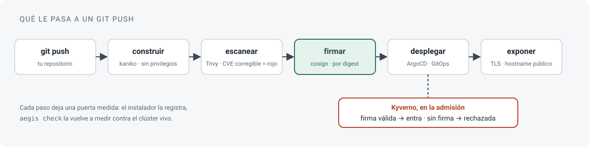
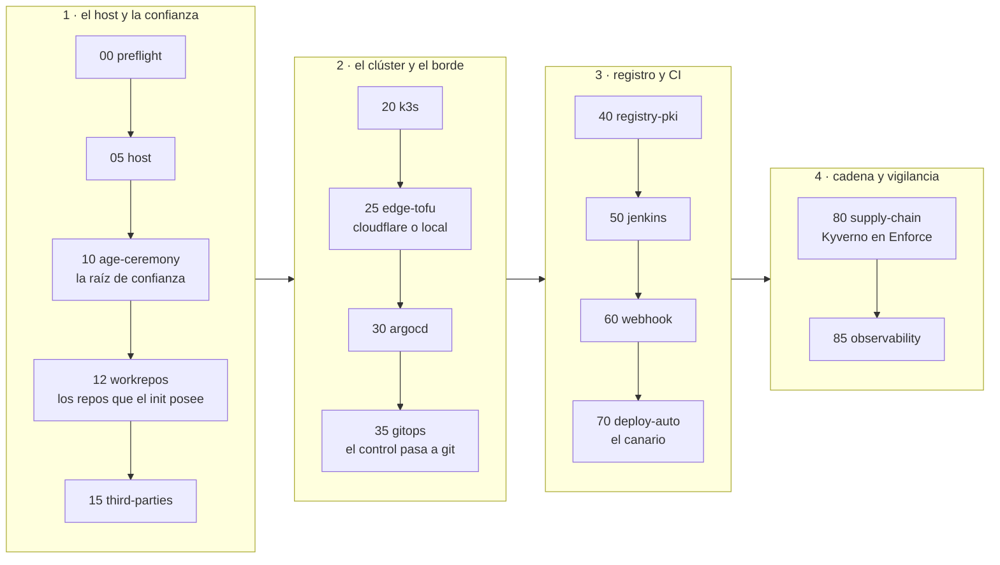
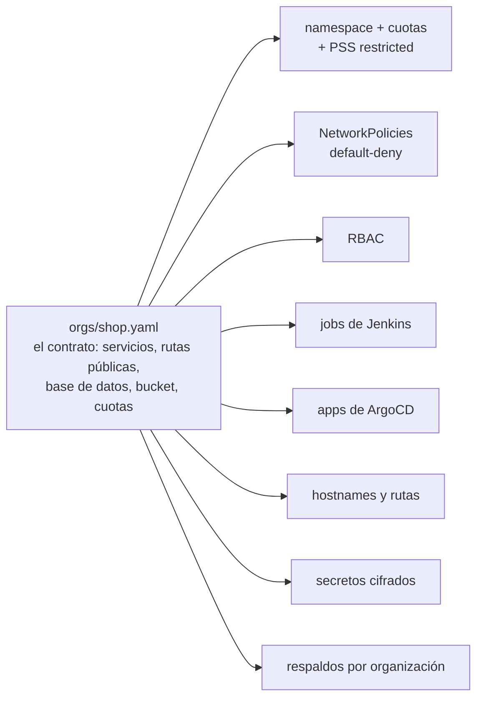
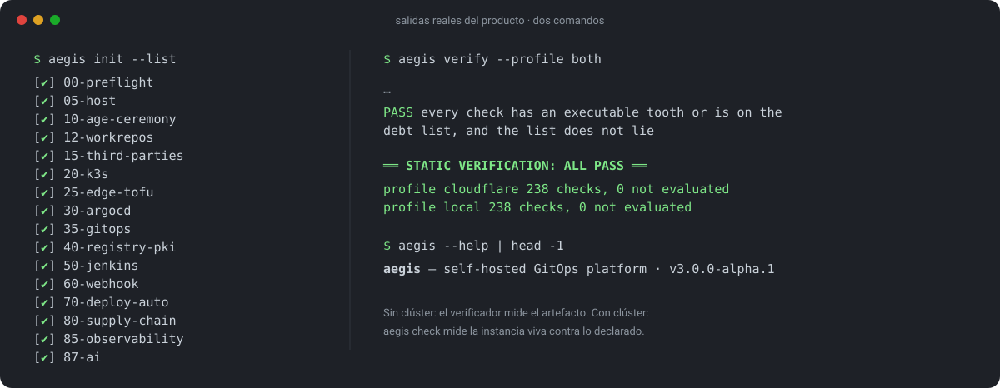

# aegis-infra

**Una plataforma GitOps autohospedada que se instala sola y después lo demuestra.**

Read this in English: [README.en.md](README.en.md)



Pones una máquina Linux y una cuenta de GitHub. `aegis init` las
convierte en una plataforma Kubernetes donde cada `git push` se
construye en un pod sin privilegios, se escanea, se firma por digest,
se despliega por GitOps y se expone a internet con TLS. Una imagen sin
firma se rechaza en la admisión, no se descubre después.

> **Estado: avance técnico (*technical preview*).** Esta es la versión
> para desarrolladores y equipos de plataforma. Está medida, no pulida:
> la instalación completa corrió de extremo a extremo en una máquina
> ajena (ver [dónde se probó](#dónde-se-probó)) y cada afirmación de
> este documento sale de una puerta o de un check que se puede volver a
> ejecutar. Una capa más amigable, para quien no quiere leer un
> Jenkinsfile y para desarrolladores junior, es lo próximo que se
> construye encima de esta. Todavía no está.

---

## En dos minutos

| | |
|---|---|
| **Qué es** | Un instalador por fases (`aegis init`) que levanta k3s, ArgoCD, Jenkins, un registro de imágenes con PKI propia, Kyverno, cosign, Trivy, Traefik y observabilidad, y los deja hablándose entre sí. |
| **Para quién** | Un equipo y sus proyectos, en su propio hardware o en un VPS. No es para una flota ni para quien todavía no quiere leer un `Jenkinsfile`. |
| **Qué lo distingue** | Cada paso del instalador registra una **puerta medida**; 136 checks estáticos verifican el artefacto sin clúster, y cada check tiene un **diente** (una mutación que prueba que muerde); la ronda `aegis check` mide el clúster vivo contra lo declarado. El silencio nunca cuenta como éxito. |
| **Qué obtienes** | Cadena de suministro con dientes (build sin privilegios → scan → firma → admisión en Enforce), tenants derivados de un contrato YAML, observabilidad que se vigila a sí misma, respaldos y rotación de credenciales ensayados, y `aegis destroy` para deshacerlo todo. |

## Dónde se probó

**El entorno:** un VPS alquilado (4 CPU / 16 GB, Ubuntu, nada más que
ssh), una **cuenta de GitHub nueva** y **sin dominio** (`EDGE=local`).
Es decir, sin nada de lo que el autor tiene a mano en su propia
máquina. Todo lo de abajo ocurrió ahí el 2026-08-27, y la tabla
completa, con cada puerta, está en `docs/journeys/foreign-instance.md`.

- **Instalación desde cero:** 15/15 fases, 174 puertas pasadas, 20
  registradas como *no evaluables* (necesitan un borde público).
- **Dos aplicaciones dadas de alta desde su contrato**, con sus datos
  restaurados desde respaldos (12 productos, 4 pedidos) y su catálogo
  servido por HTTPS.
- **Cadena de suministro de extremo a extremo:** imagen firmada
  admitida; imagen sin firma rechazada citando la política; espejo y
  vigilancia diaria con cero CVEs corregibles.
- **Respaldo y restauración del estado** en un segundo directorio de
  instancia: ida y vuelta verificada.
- **Destruir y reinstalar sobre los restos:** `aegis destroy --k3s` y un
  segundo `aegis init` sobre el mismo host sucio, 15/15 fases. Lo que
  una instancia previa deja atrás (una política de admisión heredada,
  una CA obsoleta, un registro que ya no existe) ahora lo detecta y lo
  repara el propio init.

Esa primera corrida en máquina ajena necesitó catorce reanudaciones
(`aegis init --from`) y encontró unos treinta defectos que los checks
estáticos no podían ver: errores de la *distancia* entre el producto y
su primera instancia real. Están todos cerrados, cada uno con su check,
y sus clases tienen nombre en `seed/platform/docs/failure-modes.md`.

**Lo que todavía no se ha medido:** el perfil de borde `cloudflare` en
una máquina ajena. Bajo `EDGE=local` sus puertas quedan registradas como
no evaluables.

## Antes de empezar: lo que conviene tener listo

Para probarlo **completo** hacen falta GitHub **y** Cloudflare. Sin
Cloudflare, `EDGE=local` te da la plataforma entera (build, scan,
firma, admisión, GitOps, observabilidad) sobre nombres que resuelven
al host, y las puertas del borde público (unas veinte) quedan como *no
evaluables*. Es una buena primera corrida; no es la corrida completa.

- **GitHub.** Una cuenta con `gh auth login` hecho; el preflight dice
  qué permisos pide (`repo`, `delete_repo`). El init **crea y posee**
  dos repos con nombres nuevos, y después uno por aplicación; los
  *deploy keys* y los webhooks los crea él, no tú. Una cuenta u
  organización dedicada es lo más cómodo.
- **Cloudflare, para el perfil `cloudflare`.** Una zona en tu cuenta
  (un dominio con sus nameservers en Cloudflare), el ID de cuenta y el
  ID de zona (el asistente los pide), y **una credencial maestra
  efímera** con la que el init acuña sus dos tokens acotados: tu
  *Global API Key* o un token de cuenta con el permiso «Account API
  Tokens: Edit». Vive solo en memoria durante la fase `15`; si la
  pasas por archivo (`CF_MASTER_FILE`), destrúyelo al terminar; el
  init te lo recuerda. Conviene saber crear tokens en el panel de
  Cloudflare antes de sentarse.
- **Un lugar seguro para la clave age, decidido de antemano.** Es la
  raíz de confianza: descifra todo, y perderla es perder todo lo
  cifrado, incluidos los respaldos de estado (van cifrados con ella).
  La fase `10` la genera, la deja leer **una sola vez y fuera del
  pane** (en tmpfs, desde otra terminal), y exige un respaldo validado
  cifrando y descifrando de verdad; sugiere un USB offline más una
  carpeta fuera de la máquina. Ten listo dónde va a ir (gestor de
  contraseñas, USB, papel) y que no sea el mismo host. Y **nunca
  grabes la sesión** (`script`, `tmux pipe-pane`, asciinema) durante
  esa fase.
- **Sin operador** (`--non-interactive`): `AEGIS_AGE_BACKUP_FILE`
  (idealmente en `/dev/shm`) para el respaldo de la clave y
  `CF_MASTER_FILE` para la credencial de Cloudflare; el init se niega a
  correr sin ellos.
- **Un correo de contacto** para los certificados (el asistente lo
  infiere de `git config`) y una sesión ssh que no se caiga: tmux.

Lo que **no** hace falta preparar: claves de cosign, certificados,
registros DNS, el túnel, las credenciales del registro interno. Todo
eso lo genera el init y lo puede rotar `aegis rotate`.

## Requisitos

| | |
|---|---|
| **Host** | Linux con `sudo`. Ubuntu es lo que se ha corrido; el playbook que prepara el host exige Ubuntu 24.04 o superior con systemd. El preflight configura `sudo` sin contraseña, instala con `apt` tmux, python3-yaml y jq (y `gh` si falta), y exige curl, git y python3 ya presentes. |
| **Recursos** | 4 CPU y 8 GB de RAM alcanzan (el preflight avisa por debajo de 7 GB). 25 GB libres en `/`; `/dev/shm` escribible. |
| **Red** | Salida a internet por IPv4: el preflight sondea github.com, api.github.com, api.cloudflare.com, get.k3s.io, dl.k8s.io y Docker Hub. Reloj en hora (≤ 120 s frente a GitHub) e IPv6 apagado; el preflight hace ambas cosas. |
| **GitHub** | `gh` autenticado con `gh auth login` (el preflight dice qué permisos pide). El init **crea y posee** dos repos, plataforma y canario, con nombres nuevos. Identidad git global (`user.name`, `user.email`). |
| **Opcional: Cloudflare** | Una cuenta con una zona, para `EDGE=cloudflare` (hostnames públicos, túnel, TLS de un emisor ACME). Sin ella, `EDGE=local` da la misma plataforma sobre nombres que resuelven al host (vía sslip.io), con TLS de la CA propia de la instancia. |

Un host con restos de otra instancia también funciona (está medido); el
init avisa si los encuentra.

## Empezar

```bash
git clone <la URL de este repositorio> aegis-infra
cd aegis-infra
./bin/aegis preflight      # deja la máquina como la necesita el init, o dice por qué no
gh auth login              # si el preflight lo pidió; después, preflight otra vez
tmux new -s aegis          # el init es largo; una sesión ssh caída lo mataría
./bin/aegis init           # el asistente de configuración y, después, quince fases
```

En adelante este documento escribe `aegis` a secas; es `./bin/aegis`
desde el checkout del producto, y `aegis --help` es el mapa.

**Cuenta con horas, no con minutos.** Cuánto, depende de la máquina y
de la conexión; la fase larga es la 80, la que espeja y construye las
imágenes de la plataforma. Por eso el tmux.

**Dónde queda todo.** Este checkout es el producto y no se escribe
durante una corrida. La instancia, lo que es de esta máquina, vive en
`~/aegis` (o donde apunte `AEGIS_HOME`): `aegis.conf`, el checkout del
repo de plataforma en `platform/`, los marcadores y las puertas en
`.init-state/` y el almacén cifrado en `.state-secrets/`.

**El asistente** pregunta lo que no puede inferir: el perfil de borde
(`cloudflare` o `local`), los nombres de los dos repos que el init crea,
el dominio raíz (bajo `local` propone uno de sslip.io), el contexto de
kubectl, el ClusterIP del registro interno y el espacio de trabajo para
direnv; bajo `cloudflare`, además, el ID de cuenta y de zona; bajo
`local`, dónde escucha el puente. El dueño de GitHub lo saca de la
sesión de `gh` y el correo de contacto para certificados, de
`git config`. Muestra un resumen, pide confirmación y escribe
`aegis.conf` de forma atómica.

### Cuando termina

La fase `10-age-ceremony` te habrá mostrado un secreto, el único de
toda la corrida: la clave age, la raíz de confianza de la instancia, en
`~/.config/sops/age/aegis.key`. Guárdala donde el init te indica; sin
ella no se lee nada de lo que sigue.

Las puertas de la plataforma cuelgan del dominio raíz: `argocd.`,
`jenkins.`, `grafana.` y `ntfy.<dominio>`; `aegis.<dominio>` es el
canario, la primera aplicación que la propia plataforma construyó,
firmó y desplegó. Bajo `cloudflare` las consolas quedan detrás de
Access; bajo `local` los nombres resuelven al host vía sslip.io y el
certificado lo firma la CA de la instancia, así que el navegador
avisará hasta que la importes.

Las contraseñas de administración no se imprimen: nacen cifradas en el
almacén (`~/aegis/.state-secrets/`), como `jenkins_admin_pass.enc`,
`grafana_admin_pass.enc` y `argocd_admin_pass.enc`. Se leen con la
clave age:

```bash
export SOPS_AGE_KEY_FILE=~/.config/sops/age/aegis.key
sops -d --input-type binary --output-type binary ~/aegis/.state-secrets/jenkins_admin_pass.enc
```

Y en adelante, la rutina:

```bash
aegis check               # mide el clúster vivo contra lo declarado, sin escribir nada
aegis init --list         # qué fases hay y cuáles pasaron
```

<details>
<summary><b>Si se cae</b></summary>

Cuando una fase falla, el init se detiene en ella y deja su puerta
registrada. Arregla la causa y reanuda:

```bash
aegis init --from 30      # reanuda desde la fase 30 (las anteriores ya pasaron)
aegis init --only 60      # repite una sola fase
aegis init --check        # mide sin cambiar nada
aegis init-log            # lo mismo que init, dejando un dosier completo de la corrida
```

`aegis init-log` imprime la ruta del dosier *antes* de empezar, para
que la conozcas aunque la corrida muera. La caja negra es
`.init-state/gates.jsonl`; `docs/OPERATE.md` explica por dónde empezar
a diagnosticar.

Para empezar de cero sobre el mismo host:

```bash
aegis destroy             # sin --yes es un dry-run: dice qué quitaría
aegis destroy --yes --k3s # quita el borde, el puente y el clúster
aegis init --reset-state  # olvida todas las puertas y vuelve a empezar
```

`aegis destroy` no borra los repos de GitHub: llevan el topic marcador
del init y una reejecución los reutiliza.

</details>

## Dar de alta una aplicación

Hay una plantilla, `base`: un servicio HTTP mínimo en Go, con su
contrato, un `Containerfile` que corre sin root, overlays de kustomize
y el script que escribe el digest. El `Jenkinsfile` no vive en la
plantilla: `aegis org` lo instancia desde la plantilla canónica.

Todo ocurre en el repo de plataforma de la instancia: ahí viven los
contratos, en `orgs/`, y ahí se hace el commit.

```bash
cd ~/aegis/platform
aegis app new shop --template base   # escribe contrato, esqueleto, derivaciones y secretos; no toca el mundo
git diff                             # lee lo que derivó
git add -A && git commit -m "org: shop" && git push
aegis sync root                      # ArgoCD recoge la organización nueva
aegis app apply shop                 # crea el repo, la clave de despliegue y el webhook en GitHub
```

`aegis app apply --check` muestra lo que haría sin tocar nada. Desde
el primer push al repo de la app, la plataforma la construye, escanea,
firma, despliega y expone. La plantilla desaparece una vez instanciada:
desde ahí el contrato y el repo son tuyos y los editas a mano. Para
cambiar la organización, editas el contrato y vuelves a derivar:

```bash
$EDITOR orgs/shop.yaml               # añadir postgres, bucket, otro servicio…
aegis org plan orgs/shop.yaml        # qué cambiaría, sin escribir
aegis org apply orgs/shop.yaml       # escribe los manifiestos
aegis secret create orgs/shop.yaml   # si aparecieron secretos nuevos
```

`seed/platform/docs/platform-for-developers.md` es la página que se
entrega al equipo que va a hacer push: el ciclo de vida de un push y
las reglas que lo rechazan.

## Cómo funciona

### Las quince fases, en cuatro etapas



Cada fase deja un marcador y registra sus puertas en
`.init-state/gates.jsonl`; reejecutar converge: una fase pasada no se
repite salvo que `--from` o `--only` lo pidan. El orden no es
cosmético: la política de admisión se activa cuando ya hay una imagen
firmada que admitir, la observabilidad se instala al final porque mide
lo que ya existe, y los secretos entran antes que los charts que los
consumen.

<details>
<summary><b>Las quince fases, una por una</b></summary>

| fase | qué hace |
|---|---|
| `00-preflight` | Comprueba las precondiciones y muestra los límites conocidos. Lanza el asistente de configuración si no hay `aegis.conf`. Si falta algo, aborta aquí, no a mitad del clúster. |
| `05-host` | Instala en el host el userland fijado por versión (tofu, sops, age, kubectl, helm, cosign, direnv, jq, git, openssl; `gh` con pin `apt`: basta que esté presente, y el init lo instala si falta; lo que exige es la sesión autenticada), leyendo los pins de `group_vars/all.yml`, con espera del lock de apt. |
| `10-age-ceremony` | Genera la clave age (la raíz de confianza), la valida cifrando y descifrando de verdad, deja respaldos y renderiza `.sops.yaml`. Es la única fase que muestra un secreto al operador. |
| `12-workrepos` | Crea y siembra en GitHub, vía `gh`, los dos repos propios del init (plataforma y canario), marcados con un topic. En reejecución los reutiliza; si el repo existe sin la marca, pregunta al operador antes de marcarlo (y se niega sin terminal). |
| `15-third-parties` | Credenciales de terceros sin navegador: claves de despliegue (*deploy keys*), HMAC de webhooks y credencial de CI desde la sesión de `gh`. Bajo `EDGE=cloudflare` acuña además tokens acotados de Cloudflare. |
| `20-k3s` | Prepara el kernel del host e instala k3s fijado por versión con los playbooks de Ansible del repo de plataforma. |
| `25-edge-tofu` | Levanta el borde. Con `cloudflare`: túnel, DNS y Access vía OpenTofu. Con `local`: un puente de systemd en el host que entrega 80/443 a Traefik. |
| `30-argocd` | Instala ArgoCD con helm (la única instalación imperativa) y crea con kubectl los Secrets de arranque, entre ellos la clave age para KSOPS. |
| `35-gitops` | Entrega el control a GitOps: AppProjects, App raíz y sincronizaciones en orden (cert-manager, PKI, Traefik, cloudflared…). |
| `40-registry-pki` | Registro interno de imágenes con PKI propia y TLS desde el primer día; credenciales derivadas de un único origen e instalación de la CA en el host. |
| `50-jenkins` | Jenkins con jobs-as-code desde el nacimiento y secretos antes del chart. Cierra con la imagen de herramientas de CI construida y publicada. |
| `60-webhook` | Comprueba de extremo a extremo que un push llega a Jenkins, con una puerta por eslabón (borde, hook, entrega, build existe, build verde). Bajo `EDGE=local` los eslabones de hook y entrega quedan como no evaluables; el build se mide por sondeo. |
| `70-deploy-auto` | Despliegue automático del tenant canario: el pipeline escribe el digest en el overlay y ArgoCD despliega; el anti-bucle (un commit solo de k8s no dispara build) se prueba antes de que se escriba nada. |
| `80-supply-chain` | Servidor Trivy, clave cosign y política Kyverno en Enforce, activada al final, después de que exista la primera imagen firmada. |
| `85-observability` | Sobre todo lo que ya existe: VictoriaMetrics, vmalert, Grafana, sondas y bitácora de eventos, con un latido que llega al `topic` de ntfy. |

</details>

### Producto e instancia son dos cosas

```mermaid
flowchart LR
    subgraph P["el producto · este repositorio · solo lectura durante una corrida"]
        direction TB
        p1["bin/ libexec/ lib/<br/>los comandos"]
        p2["init/<br/>las quince fases"]
        p3["verify/<br/>136 checks y sus dientes"]
        p4["seed/<br/>lo que se distribuye"]
    end
    subgraph I["la instancia · ~/aegis · estado vivo"]
        direction TB
        i1["aegis.conf"]
        i2["platform/<br/>el repo GitOps, en GitHub"]
        i3[".init-state/<br/>marcadores y puertas"]
        i4[".state-secrets/<br/>el almacén cifrado con age"]
    end
    P -- "aegis init<br/>siembra, instala, mide" --> I
    I -- "aegis check · aegis state backup<br/>aegis data backup · aegis rotate" --> I
```



Un solo archivo decide dónde vive cada cosa, en bash y en python, para
que dos comandos no puedan discrepar. Lo que no entra por `seed/` no
entró: el repo de plataforma de cada instancia nace de la semilla, con
marcadores de posición en vez de valores.

### Un contrato, todo lo demás derivado



`aegis org apply` vuelve a derivar todo desde el contrato, en bloques
marcados que se reescriben enteros: nada se escribe dos veces a mano, y
`aegis org plan` muestra qué cambiaría antes de tocar nada.

### La cadena de suministro, paso a paso

1. Un push llega a Jenkins por webhook (o por sondeo bajo `EDGE=local`).
2. kaniko construye la imagen en un pod sin privilegios; el
   Containerfile de la plantilla corre sin root bajo PSS restricted.
3. Trivy escanea con `--exit-code 1 --severity CRITICAL,HIGH
   --ignore-unfixed`: un hallazgo corregible de esa severidad detiene
   el build.
4. cosign firma por digest, nunca por tag, con la clave de la
   instancia.
5. El pipeline que construyó la imagen escribe su digest en el overlay
   de kustomize (`ci/write-digest.mjs`) y hace commit; ArgoCD
   despliega.
6. Kyverno (`require-aegis-signature`, en Enforce, con `mutateDigest`)
   rechaza en la admisión cualquier imagen sin firma válida.

Las imágenes de la plataforma siguen la misma disciplina: el job
`mirror-images` fija por versión lo que se trae de fuera, `ci-images`
construye la imagen de herramientas de CI, `base-images` fabrica las
bases propias e `image-watch` las vuelve a escanear a diario (cron
`H 6 * * *`). `aegis ci build` dispara los cuatro en ese orden;
`aegis ci digests` lista `imagen@digest` para que un humano lo lea
antes de subir un `FROM` a mano.

### Las ideas que ordenan todo lo demás

- **El contrato es la única verdad.** Las plantillas generan
  contratos; todo lo demás se deriva de ellos, de forma idempotente.
- **Converger, no ejecutar.** Todo comando que se reejecuta con el
  trabajo ya hecho termina en *nada que hacer*.
- **Cuatro salidas, siempre.** `0` hecho o ya estaba · `1` mal o
  falta · `2` no se pudo evaluar · `3` uso inválido. *No se pudo
  evaluar* es una respuesta de primera clase: un instrumento que nunca
  llegó a su sujeto no dice que el sujeto esté bien.
- **El silencio nunca es éxito.** Una puerta sin sujeto se registra
  como tal; un build que nunca apareció es un fallo; un asistente de
  configuración que no pudo escribir el archivo muere en vez de seguir.
- **Un check que no muerde no existe.** Cada check viene con la
  mutación que demuestra que falla cuando debe (`aegis verify --teeth`).
- **El producto no nombra máquinas ni personas.** Dos checks mantienen
  fuera direcciones e identidades, para que lo que se instala aquí se
  instale en cualquier parte.



## Los comandos

`aegis --help` imprime el menú; `aegis <cmd> --help`, el detalle de
cada uno. Todos, salvo `aegis verify`, devuelven los mismos cuatro
códigos de salida; `verify` usa 0, 1 y 3, donde 3 es un defecto del
propio verificador.

| grupo | comandos |
|---|---|
| setup | `aegis preflight` · `aegis init` · `aegis init-log` · `aegis verify` · `aegis destroy` |
| apps | `aegis app` · `aegis org` · `aegis secret` |
| operate | `aegis check` · `aegis sync` · `aegis ai` |
| infra | `aegis ci` · `aegis edge` · `aegis registry` · `aegis rotate` · `aegis webhook` |
| backup | `aegis data` · `aegis state` |

<details>
<summary><b>Cada comando, en una línea</b></summary>

**setup**

| comando | qué hace |
|---|---|
| `aegis preflight` | Deja la máquina en el estado que el init necesita (sudo sin contraseña, IPv6 apagado, DNS, reloj, paquetes, identidad git). Sin argumentos: actúa y repara. |
| `aegis init` | El orquestador: levanta la plataforma fase por fase y registra una puerta por paso. Reejecutar converge. `--from N`, `--only N`, `--check`, `--configure`, `--list`, `--reset-state`, `--non-interactive`. |
| `aegis init-log` | Ejecuta `aegis init` bajo `script`, dejando un dosier completo de la corrida. Acepta los mismos flags. |
| `aegis verify` | Verificación estática del artefacto, sin clúster: los checks de `verify/checks/`. `--profile cloudflare\|local\|both`, `--only NNN`, `--teeth [NNN]` (prueba que cada check muerde), `--harness` (los arneses funcionales), `--with-charts`, `--list`. |
| `aegis destroy` | Deshace la huella del init en el borde y en este host; con `--k3s` también el clúster; con `--purge-secrets`, el almacén de la instancia. Sin `--yes` es un *dry-run*. No borra los repos de GitHub. |

**apps**

| comando | qué hace |
|---|---|
| `aegis app new` / `apply` | `new` escribe el alta entera en archivos (contrato desde una plantilla con `--template`, esqueleto, derivaciones, secretos) sin tocar el mundo; `apply` ejecuta los pasos de GitHub de cada contrato: repo, esqueleto, clave de despliegue, webhook (`--check` para verlo sin tocar nada). |
| `aegis org plan` / `apply` / `validate` / `edge` / `routes` / `plan-delete` / `delete` / `migrate` | `plan` muestra qué cambiaría; `apply` escribe los manifiestos; `validate` solo valida el contrato; `edge` deriva los hostnames públicos de todos los contratos; `routes` deriva el ConfigMap de rutas de IA (`ai-ruteo`); `plan-delete` muestra qué borraría; `delete` borra del repo y *dice* qué retirar del clúster; `migrate` lleva un contrato a una versión nueva. |
| `aegis secret create` / `rotate` / `move` | Crea los secretos cifrados que faltan (nunca regenera), reemplaza el material, o copia un secreto a otro namespace (`move` necesita la clave age). |

**operate**

| comando | qué hace |
|---|---|
| `aegis check` | La ronda rutinaria. Sin argumentos y sin escribir nada: mide el clúster vivo contra lo declarado (firma en Enforce, respaldos por organización, desincronías). |
| `aegis sync` | Dispara un sync de ArgoCD de las apps nombradas sin pasar `syncOptions`; `--drifted` sincroniza todo lo que no esté Synced. |
| `aegis ai` | El control del operador sobre el sustrato de IA; queda fuera de este documento. |

**infra**

| comando | qué hace |
|---|---|
| `aegis ci build` / `digests` | `build` dispara los jobs de imágenes de la plataforma en orden (`mirror-images` → `ci-images` → `base-images` → `image-watch`) y espera a cada uno; `digests` lista `imagen@digest` de lo que guarda el registro interno. |
| `aegis edge check` | Compara los hostnames vivos con los derivados de los contratos. |
| `aegis registry check` / `rotate` | `check` verifica que la credencial del registro interno esté alineada en sus diez destinos; `rotate` la genera de nuevo y reescribe los diez. |
| `aegis rotate list` / `check` / `run` / `continue` | El protocolo de rotación hecho ejecutable: inventario, comprobar si una credencial funciona sin rotarla, rotar (con el radio de impacto a la vista) y reanudar un lote interrumpido. |
| `aegis webhook check` / `apply` | Mide que todo repo con job tenga webhook; crea los que faltan resincronizando el HMAC. |

**backup**

| comando | qué hace |
|---|---|
| `aegis data backup` / `list` / `restore` | Los DATOS de los tenants: un bundle por organización. `list` mira dentro sin restaurar; `restore` exige `--org` y, si la credencial rotó desde la captura, `--force`. |
| `aegis state backup` / `restore` | Los tres estados que viven solo en esta máquina y que ningún git guarda: el almacén cifrado, los marcadores de fase y el tfstate del borde. Perder cualquiera obliga a rehacer la instalación a mano. |

`state` es la máquina (lo que hace falta para reconstruir la
instalación); `data` son los tenants (lo que hace falta para
reconstruir sus aplicaciones y sus datos). El respaldo de uno no
restaura el otro.

</details>

## Qué hay dentro

```
bin/          el despachador (aegis <comando>)
libexec/      un archivo por comando
lib/          los helpers compartidos, bash y python
init/         el orquestador y sus quince fases
verify/       los checks, sus dientes, los arneses
seed/         lo que se distribuye: el repo de plataforma, el canario, las plantillas
share/        los códigos de salida y las unidades de systemd
docs/         AGENTS.md (cómo cambiar esto), OPERATE.md (cómo operarlo),
              el glosario, los journeys de diseño
```

Lo que corre en el clúster: k3s v1.35.4+k3s1 (sin Traefik ni servicelb
de fábrica), instalado por Ansible; ArgoCD con KSOPS; Jenkins con
jobs-as-code y kaniko; Trivy, cosign y Kyverno; Traefik y cert-manager
con CA interna; cloudflared solo bajo `EDGE=cloudflare`; un registro
interno de imágenes con TLS de la PKI propia; Garage (S3) y Postgres 17
como tipos de servicio, un bucket y una base de datos por organización;
VictoriaMetrics, VictoriaLogs, Grafana, Vector, blackbox-exporter,
Alertmanager y ntfy; NetworkPolicies por tenant (default-deny con
egress DNS) y PSS restricted en el canario y en cada namespace de
tenant. En el host: sops 3.9.4 y age 1.2.1 para el almacén cifrado,
OpenTofu 1.12.3 solo para el borde de Cloudflare (túnel, DNS y Access).

Por dónde empezar a leer:

- `docs/AGENTS.md`, si vas a cambiar el producto: el método, las reglas
  nacidas de incidentes reales, dónde vive cada cosa.
- `docs/OPERATE.md`, si vas a operar una instancia: estado esperado,
  diagnóstico, qué desincronías son benignas, herramientas de
  recuperación.
- `docs/glossary.md` es el vocabulario; `aegis verify` lo hace cumplir.
- `docs/journeys/foreign-instance.md` es el ensayo en máquina ajena,
  escrito para repetirse.
- `seed/platform/docs/failure-modes.md` cataloga las clases de fallo
  (enfermedades A a H) con firma y arreglo.
- `seed/platform/docs/platform-for-developers.md` es lo que lee el
  equipo que hace push.

## Lo que no está

Dicho claro, porque los checks lo dirían igual.

- El perfil `cloudflare` no se ha corrido en una máquina ajena.
- Un arreglo en la semilla no llega a una instancia ya sembrada;
  resembrar una instancia viva es manual.
- `aegis data restore` restaura la base de datos, no los objetos del
  bucket (lo dice al correr). Restaurar entre instancias no es
  automático: el bundle viene cifrado a la clave age de la instancia
  que lo hizo, hay que recifrarlo a la clave de la nueva, y `restore`
  exige `--force` porque detecta que la credencial de la base de datos
  cambió; tras `--force`, el rol de la base de datos se realinea a mano.
- Una sola plantilla de aplicación (`base`). Una plantilla de sitio
  estático y un Jenkinsfile multi-servicio están diseñados, no
  distribuidos.
- `aegis secret create` no deriva la copia por namespace de la
  credencial del registro; `aegis secret move` lo hace, con la clave
  privada.
- Kyverno solo alcanza registros que firma la CA de la instancia; una
  imagen pública se rechaza con un error `x509`, no con «sin firma».
- Un solo nodo. Sin HA ni multi-clúster: es una plataforma para un
  equipo y sus proyectos, no para una flota. En reposo reserva
  alrededor de 2,5 CPU; un nodo de 4 CPU admite un build a la vez.
- Algunos identificadores dentro de la semilla siguen en español a
  propósito: cada uno se mueve con la instancia que lo lee, y el
  glosario lista todos los pendientes.
- Exige leer. La capa más amigable es la próxima pieza de trabajo y se
  construye encima de esta, no en su lugar.

**Lo próximo**, en este orden de intención y sin fechas: la capa
amigable para personas no técnicas y desarrolladores junior; el perfil
`cloudflare` en una máquina ajena, con sus puertas pasando de *no
evaluable* a medido; más plantillas de aplicación.

## Sobre el idioma y el historial

El producto está en inglés: código, identificadores, mensajes, la
semilla y la documentación interna (`docs/`, `seed/platform/docs/`).
`docs/glossary.md` decide qué palabra inglesa representa cada idea y un
check lo hace cumplir. Este README en español es la página principal
por ahora; `README.en.md` es la versión en inglés, y la intención es
que toda la documentación pública termine en inglés. El historial de
commits está en español a propósito: es registro de trabajo, no
producto, y se conserva tal cual: cuenta cómo se encontró cada bug.

Este historial empieza con la reconstrucción v3 y cuenta solo esa
parte. El grueso del trabajo (la versión 2, que sigue corriendo la
instancia del autor, sus repos de plataforma y las sesiones que la
precedieron) vive en repositorios privados y no está aquí, porque
lleva la identidad de una instancia concreta. Quizá algún día se
libere. Lo que sí conviene saber: este proyecto no salió de una sola
sesión ni de un prompt; cada pieza de arriba tiene detrás corridas que
fallaron y checks que nacieron de ellas.

## Contribuir, seguridad, licencia

- `CONTRIBUTING.md`: el método es corto y no negociable. Un ítem, un
  commit; un check por cada arreglo; un diente por cada check;
  `aegis verify --profile both` en verde antes de hacer commit, y
  `--teeth NNN` para los checks que tocaste. Nada está *hecho* hasta
  que una corrida lo valida en una instancia real.
- `SECURITY.md`: cómo reportar una vulnerabilidad en privado, con el
  reporte privado de GitHub de este repositorio (*Security → Report a
  vulnerability*), nunca por un issue público.
- Licencia Apache, versión 2.0; ver `LICENSE`.
